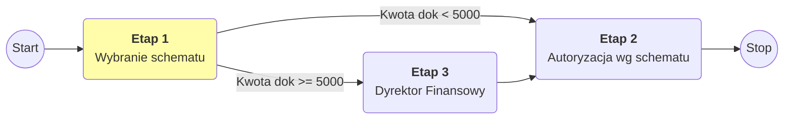
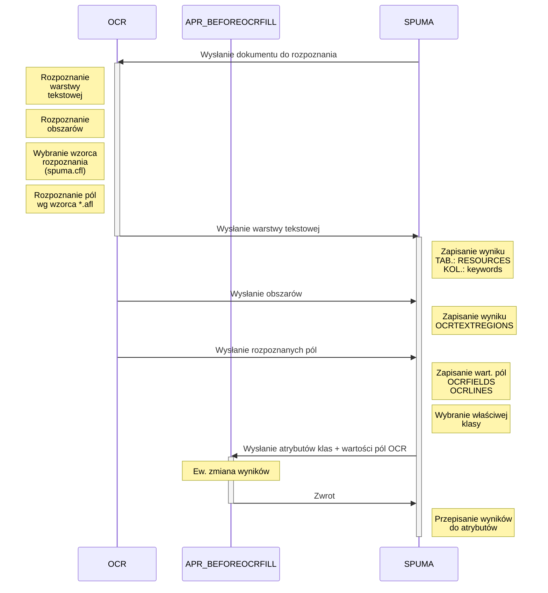
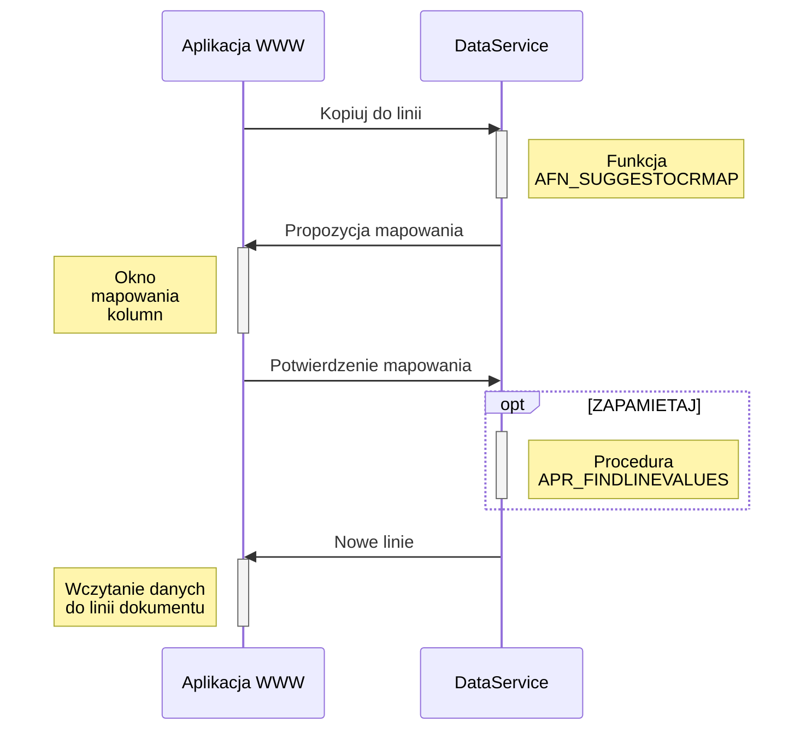

# Wstęp
System SPUMA konfigurowany jest na dwa sposoby :
- przez aplikacje `SPUMA_ADMIN`
- przez procedury i funkcję serwera SQL (opcjonalne)

Konfiguracja docelowo zapisywana jest w całości w bazie SQL (baza SPUMA).  

# Aplikacja SPUMA_Admin

Do aplikacji logujemy się użytkownikiem który ma zaznaczoną rolę administratora. Zaraz po instalacji jest to domyślnie użytkownik admin
> Aplikacja `SPUMA_ADMIN` dostępna jest z poziomu serwera z katalogu `Spuma/Server`

## Konfiguracja
Konfiguracja ta została częściowo opisana w rozdziale dot [instalacji](../manual-install)

### Ogólne
- `Profil` – Nazwa profilu konfiguracyjnego. 
- `Aktywny` - Czy profil jest aktywny

    > System może posiadać kilka profili konfiguracyjnych. Dlatego istnieje możliwość dezaktywowania nieużywanego profilu

- `SMTP address, SMTP user, SMTP port, SMTP password` - domyślne ustawienia konta email do wysyłki powiadomień. 

    > Ustawienie może nadpisać konfiguracja użytkownika

- `Session file` - lokalizacja pliku na serwerze z  plikiem sesji
- `Client ID` - unikatowy ID klienta SPUMY 
    > ID Klienta ustalane jest na etapie zakupu aplikacji. Używane jest m&#46;in. w mechanizmie OCR do identyfikacji własnych schematów rozpoznawania

- `Skala inicjalna` - Skala powiększenia z jaką domyślnie wczytuje się podgląd dokumentów. (0 - na cały ekran)

- `Długość cache` - Ilość dokumentów przechowywanych w historii

### OCR
Konfiguracja mechanizmu OCR

- `Ocr Task Mode` - Informacja o metodzie rozpoznawania dokumentów:

    | Ocr Task Mode| Opis |
    | ------- | ---- |
    | Zewnętrzny&nbsp;WebService| Ustawienie domyślne. Program korzysta z usługi SPUMA OCR Service (SOS). |
    | Dysk | (nierozwijane) Ustawienie stosowane z innymi niż  SOS mechanizmami rozpoznawania. Wymiana odbywa się poprzez dwa  katalogi - wejściowy `OCR input` i wyjściowy `OCR output` |

- `SOS address`, `SOS port` - Adres i port  usługi SOS

    > Istnieje możliwość korzystania z zewnętrznego serwisu OCR, udostępnianego przez  dostawcę oprogramowania.

- `OCR input path` -  (tylko dla opcji  Dysk) Katalog na serwerze do którego trafiać będą dokumenty do rozpoznania 
- `OCR output path` -  (tylko dla opcji  Dysk)  Katalog na serwerze z którego pobierane będą dane rozpoznane

### Automatyzacja

Spuma ma możliwość zautomatyzowania dodawania dokumentów do sekretariatu. W tym celu, można monitorować  skrzynkę mailową lub katalog sieciowy. Dokumenty / maile które się tam pojawia i  spełnią określone warunki, zostaną automatycznie zaciągnięte do systemu

- `Interwał` - Co ile sekund mechanizm ma sprawdzać czy są nowe dokumenty

  > Aby zmienić ustawienia automatyzacji należy najpierw wybrać  `SPUMA Company` (firma) oraz  `SPUMA user id` (użytkownik)

- `Mail host`, `Mail user` , `Mail password`, `Mail port`, `Use SSL` - ustawienia skrzynki pocztowej która będzie monitorowana 

- `Wzór` - Wyrażenia regularne z którym będzie porównany specjalny ciąg. Jeśli wyrażenie będzie się zgadzać mail zostanie zaciągnięty do systemu. Specjalny ciąg ma określoną strukturę:

    ```
    Subject=Temat;Extension=Rozszerzenie_załącznika;FileName=Nazwa_pliku_załącznika
    ```

    Przykład:
    ```
    Subject=Faktura od kowalskiego;Extension=PDF;FileName=Faktura.pdf
    ```
    > Ciąg generowany jest dla każdego załącznika (lub tylko raz gdy mail nie ma załączników)


    **Przykłady wzorców dopasowania:**

    - Tylko dla wybranego rozszerzenia:  
    `Extension=PDF`
    - Dla wybranej grupy plików:  
    `Extension=(PDF|BMP|HTML|JPG)`
    - Dla plików o określonej nazwie (zawiera słowo faktura) i rozszerzeniu, niezależnie od tematu maila:
    `Extension=(PDF|HTML|JPG|PNG);FileName=.+Faktura.+`
    - Dla maili o określonym słowie kluczowym w tematu oraz rozszerzeniu załącznika:  
    `Subject=.+SPUMA.+; Extension=(PDF|JPG)`

- `Tworzenie, Klasa` - Informacja o metodzie tworzenia w SPUMIE dokumentów z maila 

    **Załączniki jako strony**
    > Treść maila oraz jego  załączniki zaczytywane są jako strony jednego dokumentu (PDF) o określonej klasie (ustawienie `Klasa`).

    **Załączniki jako dokumenty**
    > Treść maila zapisywana jest jako dokument  o określonej klasie (ustawienie `Klasa`).

- `Dodaj wiadomość bez załączników` - Czy dodawać też wiadomości które nie maja załączników (sama treść)

- `Monitored path, Archive path` - ścieżki na serwerze skąd SPUMA pobierać będzie nowe dokumenty do wczytania (Monitored path) i po pomyślnym imporcie źródłowe pliki przenosić do archiwum (Archive path)

### Bezpieczeństwo
Ustawienia dotyczące bezpieczeństwa systemu 

- `Security key, Security IV` - Klucz i sól do szyfrowania AES (podawane jako ciąg bajtów), 
- `Ważność sygnatury` - czas ( w godzinach) ważności sygnatury pozwalającej na autologowanie z odnośnika z powiadomienia  email


### Funkcje JS
Zestaw funkcji (javascript) używanych w obliczeniach wartości atrybutów
> Pola `Numer dokumentu`  i `LID` (# linii dokumentu) służą do wpisania testowych wartości  potrzebnych do testowania poprawności funkcji

Zobacz [przykłady wykorzystania funkcji JS](../manual-samples).

###  DATASERVICE
Konfiguracja połączenia pomiędzy klientem WWW a serwerem `SPUMA_DataService`

- `MAXTHREADS` – ilość jednoczesnych wątków serwisu  
- `PORT` – port dla danych binarnych,  na którym usługa obsługuje klienta Silverlight oraz klienta mobilnego  
- `REQTIMEOUT` – czas oczekiwania na usługę (w sek.)
- `POLICYPORT` –port zasad do otwarcia połączenia TCP (dla danych binarnych)

    > **Uwaga:**  Gdy zainstalowanych jest  więcej niż jedna usługa w pozostałych instalacjach ustawić 0

- `POLICYALLOWEDPORTS` – porty które mogą być przydzielane  w ramach  zasad 

    > **Uwaga:**  Gdy zainstalowanych jest  więcej niż jedna usługa, wpis  ma znaczenie tylko w instalacji gdzie ustawiony jest POLICYPORT

- `EXRESOURCEPATH` (nierozwijana) Ścieżka do katalogu tymczasowego dla zasobów dla innych dokumentów (Word, Excel itp)
- `FORCEPREVQUALITY` - Nadpisanie jakości w jakiej przesyłany jest do aplikacji WWW podgląd pliku (0 - nie zmieniaj jakości). 
    > **Uwaga:** Należy zmieniać tą wartość tylko w przypadku stwierdzenia wolnego generowania podglądu w na stronie,

- `BUSINESSPARTNERIPC`: Port IPC po którym komunikujemy się z usługa dodawania PH do SAP
    > **Uwaga:** Należy zmieniać tą wartość tylko w przypadku gdy port domyślny jest zajęty
- `SPUMAHOSTIPC`: Port IPC po którym komunikujemy się z usługą wywoływania funkcji z zewnętrznych bibliotek (DLL)
    > **Uwaga:** Należy zmieniać tą wartość tylko w przypadku gdy port domyślny jest zajęty

- `MAXHTTPTHREADS` – ilość jednoczesnych otwartych  wątków dla klienta WWW
- `HTTPPORT`  – Port na którym usługa obsługuje klienta WWW 
- `HTTPUSESLL`  – Informacja czy klient WWW korzysta z SSL (konfiguracja strony na serwerze WWW)

### ADMIN
Konfiguracja ogólna funkcji zewnętrznych

- `ASSEMBLYPATH`  – ścieżka  gdzie przechowywane są biblioteki z funkcjami zewnętrznymi.

### <a id='konf_sbobusinesspartner' href='konf_sbobusinesspartner' hidden='true'></a>SBOBUSINESSPARTNER
Konfiguracja  połączenia z  funkcjonalnością Partnerów Handlowych w systemie SAP Business One

> Wpisy dotyczą sytuacji gdy na [konfiguracji firmy](#firmy1) mamy określony `Typ połączenia` jako `Zewnętrzny`

- `SBOLICENSESERVER` –  adres licencji SAP
- `SBODBTYPE` – wersja SQL serwera
- `DICREDENTIALS`  – loginy dla każdej z baz SAP połączonych z firmami w SPUMA. Każdy wpis reprezentuje jedną bazę 
    ```
    nazwa_bazy:* | spuma_user:sap_user:sap_user_pass
    ```    
    Przykład:
    ```
    SBODEMO_PL:*:manager:1234;SBODEMO_US:*:manager:43231
    ````
    > **Uwaga:**  Kolejne wpisy oddzielane są średnikami. Nazwa bazy musi być taka jak w konfiguracji firmy

- `SUGGESTCARDCODE` – Zapytanie SQL które proponuje nowy kod PH 


### <a id='konf_sapb1utils' href='konf_sapb1utils' hidden='true'></a>SAPB1Utils
Konfiguracja zewnętrznej biblioteki DLL SAPB1Utils. Biblioteka odpowiada za import  danych do SAP Business One

- `LICENSESERVER`  – adres licencji SAP 
- `SERVERVERSION` – wersja SQL serwera 
- `SBOUSER` –użytkownik SAP
- `SBOPASSWORD` – hasło do SAP
- `SBOLANG` – język komunikatów biblioteki SAP DI

## Organizacje
Organizacje reprezentują jednostki nadrzędne nad firmami. Mogą reprezentować kraj lub grupę firm.
Tworząc większość obiektów możemy zdefiniować, że są widoczne tylko dla danej organizacji.
Zdefiniowanie organizacji. skutkuje brakiem możliwości użycia/ wyboru  danego obiektu w obiektach nadrzędnych powiązanych z innymi organizacjami.

> **Przykład:** Mamy zdefiniowane 2 organizacje: `US` i `Polska`. Jeśli w firmie `OEC Computers` ustawimy organizację `Polska` to użytkownik organizacji `US` nie będzie widział w liście firm  do wyboru firmy ```OEC Computers```

## Firmy
Na jednej instalacji systemu SPUMA można rejestrować dokumenty  kilku firm. Dostęp  do nich reguluje się uprawnieniami. Domyślnie wszyscy maja dostęp do dokumentów wszystkich firm. Firma w ramach jednej organizacji dziali wszystkie obiekty z innymi (klasy, słowniki, schematy itp)

### Ogólne
- `Organizacja` - Do jakiej organizacji należy firma. Ustawienie `(Wszystkie)` określa, że firma jest dostępna dla wszystkich obiektów.
- `Nazwa` - Nazwa firmy widoczna w systemie
- `Baza`  - nazwa bazy sytemu ERP połączonego z daną firmą. Ustawienie używane w zapytaniach SQL (procesy UI, słowniki interaktywne, raporty , dzienniki). Podstawiane pod zmienna `$DBNAME`. Ważne również dla konfiguracji połączenia z systemem ERP (patrz [Konfiguracja/SBOBUSINESSPARTNERS](#konf_sbobusinesspartner) , [Konfiguracja/SapB1Utils](#konf_sapb1utils))
- `Katalog domyślny` - Określenie domyślnego  katalogu w repozytorium do którego  trafiają dokumenty po wyjściu z sekretariatu. Opcja nadpisywana przez analogiczne ustawienie na klasie.
    > **Uwaga:** ustawienie `(Brak)`  oznacza, ze dokumenty trafiać będą do katalogu głównego ( z nazwą firmy)

`Słowniki` - Lista słowników systemowych skojarzonych z firmą. (patrz [Słowniki/Słowniki systemowe](#slowniki_systemowe))

### Uprawnienia
Definiowanie uprawnień na firmie (patrz [Uprawnienia](#uprawnienia))

### Partnerzy handlowi
Definiowanie sposobu rejestracji atrybutu typu  `Własny` przechowującego informacje o kliencie

- `Typ połączenia` - Rodzaj połączenia z bazą klientów

    | Typ połączenia| Opis |
    | ------- | ---- |
    | Zewnętrzny&nbsp;SOAP| Dane pobierane i zapisywane bezpośrednio w bazie ERP (patrz [Konfiguracja/SBOBUSINESSPARTNER](#konf_sbobusinesspartner))  |
    | Baza&nbsp;wewnętrzna | Klienci rejestrowani są w bazie wewnętrznej SPUMA (tabela `BUSINESSPARTNERDB`)

## Użytkownicy
###  Ogólne
- `Organizacja` - Do jakiej organizacji należy użytkownik. Ustawienie `(Wszystkie)` określa, że użytkownik ma dostęp do obiektów (klas, dokumentów itp ) wszystkich organizacji.
- `Nazwa` - Nazwa (login) użytkownika.
    > **Uwaga:** Nazwa musi być unikatowa w ramach całej bazy 

- `Nowe hasło`,`Nowe hasło2` - Miejsce do zmiany/ założenia nowego  hasła.
- `Kolor komentarzy` - Określenie koloru tła komentarzy widocznych na dokumentach skanowanych.
- `SMTP address, SMTP user, SMTP port, SMTP password` - domyślne ustawienia konta email do wysyłki powiadomień. 
- `Odpowiedź na` - Określenie adresu email z którego wysyłane są powiadomienia do innych użytkowników oraz na który  przychodzą wiadomości.
    > **Uwaga:**  email musi być unikatowy  w ramach całej bazy 
- `Szablon e-mail` - Fragment tekstu dołączany do maili wysyłanych w powiadomieniach. Używany w procedurze `APR_FORMATEMAIL` [patrz Procedury SQL/APR_FORMATEMAIL](#proc_formatemail)
- `Informacje o zdarzeniach` - Ustawienie które wiadomości powinien użytkownik otrzymywać (kolumna `Wyślij`) i które po otrzymaniu zaznacza automatycznie  jako przeczytane (kolumna `Zaznacz jako przeczytane`)
- `Twórca` - Użytkownik który jest twórcą może dodawać nowe dokumenty w sekretariacie
- `Administrator` - Użytkownik może logować się do panelu administracyjnego 
- `Zablokowany` - Odebranie uprawnień do logowania się w systemie (np pracownik zwolniony)
- `Imię i nazwisko` - Używane w szablonach dokumentów oraz auto-wyliczeniach 
- `Ostatnie dokumenty` - Ilość pamiętanych ostatnio otwieranych dokumentów. Dotyczy katalogu `Ostatni używane` w aplikacji WWW
- `Domyślny dziennik` - Który dziennik korespondencji proponowany jest domyślnie  dla danego użytkownika

### Uprawnienia
Uprawnienia ustawiane w tym miejscu różnią się od głównego mechanizmu uprawnień ([patrz Uprawnienia](#uprawnienia)). W tym miejscu możemy można ustawić globalny dostęp do danej firmy. Zarówno do tworzenia jak i podglądu  dokumentów. 

| Uprawnienie | Opis |
| ------- | ---- |
| Pełne| Użytkownik ma  domyślnie dostęp do każdej z firm. Uprawnienia szczegółowe brane są z głównego mechanizmu uprawnień ([patrz Uprawnienia](#uprawnienia))    |
| Wybrane  | Użytkownik ma  dostęp tylko do wybranych firm (tabela `BUSINESSPARTNERDB`)

> **Uwaga:** Powyższe uprawnienia maja najwyższy priorytet. Po zmianie nalezy zrestartować usługę SPUMA_DataService

## <a id='klasy' href='klasy' hidden='true'></a> Klasy
Klasa (używane zamiennie ze słowem Typ) jest podstawowym obiektem klasyfikującym dokumenty w firmie. Przy jej użyciu, można dla dokumentu:
 - definiować politykę uprawnień,
 - określać zestaw atrybutów własnych i wyzwalaczy , 
 - przypisywać ścieżki autoryzacji,
 - nadawać numerację w określonym formacie,
 - alokować dokumenty w repozytorium
 - i wiele innych.

### Ogólne
- `Organizacja` - Do jakiej organizacji należy klasa. Ustawienie `(Wszystkie)` określa, że klasa i jej dokumenty widoczne są dla użytkowników wszystkich organizacji.
- `Nazwa` - Kod (nazwa) klasy.
    > **Uwaga:** Kod musi być unikatowy w ramach całej bazy. Nie wolno stosować znaków narodowych i specjalnych. Zakres dozwolony to `A-Z` i znaki  `_-` 
- `Opis` - Opis klasy - widoczny  w panelu administracyjnym i w aplikacji WWW.
- `Scieżka domyślna` - Własność służy do zdefiniowania ścieżki katalogów repozytorium do jakiej trafi dokument tej klasy po wyjściu  z sekretariatu. 
    > Przykład: `Faktury\Dział A\{DOCDATE | yyyy-MM}`
    W podanym powyżej przykładzie dokument z dnia 12.10.2017 zostanie przeniesiony do podkatalogu 

    ```
    ├── Faktury
    │   ├── Dział A
    │   │   └── 2017-10
    ```
    W definicji po nazwie po znaku `|`  możemy podać dodatkowe informacje formatujące zwracaną wartość

    > Przykłady: 
    >    - `{DOCDATE | yyyy-MM}` data dokumentu w formacie yyyy-MM
    >    -  `{USER | VALUE}` - login zalogowanego użytkownika 
    >    
    W definicji można używać następujących słów kluczowych

     | Słowo kluczowe | Opis | Informacje formatujące |
     | --- | --- |  --- |
     | `ID` | Id dokumentu |  |
     | `USER` | Zalogowany użytkownik |  `CODE` = Id   <br/> `VALUE` = Login  | 
     | `CLASS` | Klasa dokumentu |   `CODE` = Id   <br/> `VALUE` = Nazwa  | 
     | `COMPANY` | Firma dokumentu |    `CODE` = Id   <br/> `VALUE` = Nazwa  | 
     | `NAME` | Nazwa dokumentu |   |
     | `DESCRIPTION` | Opis dokumentu |    |
     | `TEMPLATEID` | Id szablonu |  |
     | `ENTERDATE` | Data wpływu dokumentu |  wyrażenie formatujące datę  |
     | `DOCDATE` | Data  dokumentu |  wyrażenie formatujące datę  |
     | `GETDATE` | Bieżąca data |  wyrażenie formatujące datę  |
    > Wyrażenie formatujące datę jest zgodne ze standardem Angular DatePipe https://angular.io/api/common/DatePipe

- `Widoczność` -  Klasę można ukryć, aby nie była widoczna w aplikacji WWW. Użytkownik nie może dodawać dokumentów tej  klasy. Ukrywanie dotyczy najczęściej klas bazowych. 
- `Kolor` - Określenie koloru klasy . Używane do wyróżnienia dokumentów na liście w aplikacji WWW.
- `Klasa bazowa` - Wybranie innej klasy w systemie SPUMA która pełnić będzie rolę bazowej. W ten sposób odziedziczone zostaną wszystkie atrybuty (zarówno nagłówka jak i linii). 
Klasy bazowe stosuje się jako szablony klas. Zapewniają one spójność nazewnictwa atrybutów

    > **Przykład:** 
    > Klasa `Faktura_bazowa` ma 2 atrybuty: `PH` i `Kwota`. 
    > Definiujemy klasę `Faktura-Dzial-A` która ma ustawiona ja jako bazową i  dodajemy tylko 1 atrybut `Typ_plantosci`. 
    > W efekcie klasa `Faktura-Dzial-A` ma 3 atrybuty: `PH` , `Kwota` i `Typ_plantosci`

- `Klasa zalącznika` , `załacznik do OCR`  -  Określenie klasy dla dokumentu rejestrowanego w aplikacji WWW jako załącznik. Umożliwia to dodawanie do istniejących dokumentów  dodatkowych załączników, bezpośrednio z plików, bez konieczności rejestrowania ich w sekretariacie. Załączniki te zostaną zarejestrowane jako osobny dokument i będą  automatycznie  przypięte do źródła.
    > Przykład zastosowania: Paragony do dokumentu delegacji 

    O tym, czy taki załącznik jest przetwarzany przez mechanizm OCR, decyduje ustawienie `załacznik do OCR`
    > **Uwaga:** Ustawienie wartości `(brak)`  wyłączy na danej klasie funkcjonalność dodawania załączników.

- `Dopasowanie` - Wyrażenie regularne sprawdzane dla warstwy tekstowej rozpoznanego dokumentu. Jeśli jest spełnione, dokument zmieniając status `Rozpoznawany` na `Do sprawdzenia` automatycznie określa się tą klasą.
    > **Przykład:** Klasa  `faktura kosztowa` ma określone wyrażenie regularne `\bfaktura\b`  w polu `Dopasowanie`. W związku z tym, każdy dokument, który będzie mieć po rozpoznaniu OCR , w warstwie tekstowej słowo `faktura` zostanie zakwalifikowany jako klasa  `faktura kosztowa`

- `Format nazwy` - Ciąg znaków określających jak tworzone będzie nazewnictwo (numer kancelaryjny) dokumentu danej klasy. W nawiasach klamrowych określone są słowa kluczowe które pobierają do nazwy własności dokumentu:

    | Słowo kluczowe | Opis |
    | --- | --- | 
    | `CLASSNAME` | Nazwa klasy |  
    | `CARDCODE` | Kod atrybutu własnego [Patrz Atrybuty](#atrybuty) |  
    | `DOCNUM` | Numer dokumentu |  
    | `ID` | Id dokumentu (z bazy) |  
    | `UNIQID` | Unikatowe Id dokumentu w ramach klasy  |  
    | `CMPNAME` | Nazwa firmy |  
    | `USERNAME` | login użytkownika |  
    | `DOCDATE` | Data dokumentu |  
    | `DD_DD`, `DD_MM`, `DD_YY`, `DD_YYYY` | Dzień, miesiąc lub rok  z daty dokumentu  
    | `ENTERDATE` | Data wpływu |  
    | `ED_DD`, `ED_MM`, `ED_YY`, `ED_YYYY` | Dzień, miesiąc lub rok  z daty wpływu  
    | `CREATEDATE` | Data utworzenia dokumentu |  
    | `CD_DD`, `CD_MM`, `CD_YY`, `CD_YYYY` | Dzień, miesiąc lub rok  z daty utworzenia dokumentu  

    > **Uwaga:** Można również podstawiać wartości atrybutów własnych. Należy wtedy użyć konstrukcji `{{NAZWA_ATRYBUTU}}` 

- `Własny schemat` - Możliwość definiowania własnego schematu autoryzacji
- `Schemat jest wymagany` - Określenie konieczności autoryzowania dokumentu. Nieaktywna opcja `bez autoryzacji`
- `Schematy autoryzacji` - Zaznaczenie schematów i procesów  które można użyć do autoryzacji dokumentów  danej klasy
- `Domyślny schemat` - który z wybranych  schematów lub procesów podpowie się jako domyślny
- `Metoda kopiowania uprawnień` - Włączenie opcji kopiowania na uprawnienia dokumentu  uczestników wybranej autoryzacji. Opcje:

    | Metoda | Opis |
    | ------- | ---- |
    | ***Nigdy***| uprawnienia nie są kopiowane |
    | ***Zawsze*** | uprawnienia są zawsze kopiowane |
    | ***Pytaj*** | wyświetli się monit z pytaniem. |

- `Kontrola unikalności nazwy` - sprawdzanie czy nazwa dokumentu jest unikalna w ramach całej bazy
- `Kontrola formatu nazwy` - Jak generowana jest nazwa dokumentu:
    | Metoda | Opis |
    | ------- | ---- |
    | ***Automatycznie***| Nazwa generowana jest automatycznie i nie można jej edytować. |
    | ***Pozówl edytować*** | Nazwa generuje się przez przycisk  i można ją zmieniać, ale musi spełniać wymagania formatu określonego we własności `Format nazwy` |
    | ***Nie sprawdzaj*** | Nazwa generuje się przez przycisk  i można ją zmieniać dowolnie. |
 
    >**Uwaga:** Generowanie nazwy (przy ustawieniu `Automatycznie`) i sprawdzenie poprawności  wykonywane jest przy wyjściu dokumentu z sekretariatu w celu zapewnienia unikalności numeru UNIQID

- `Kontrola unikalności numeru` - sprawdzanie czy numer dokumentu jest unikalny w ramach całej bazy
- `Numer dokumentu wymagany` - Dokumenty tej klasy wymagać będą podania numeru 
- `Automatyczne dodanie linii` - Przy dodawaniu linii w aplikacji WWW automatycznie po wypełnieniu ostatniej kolumny zostanie dodana nowa pusta linia.

### <a id='klasy_atrybuty' hidden='true'></a> Atrybuty
Atrybuty klasy dzielą się na atrybuty nagłówka i linii. Te pierwsze definiują jedną wartością per dokument. Atrybuty linii są kolumnami tabeli opisującej np. rozbite koszty  na działy, lub trasy wyjazdów (dla delegacji). 

#### Własności
- `Nazwa` - Nazwa (kod) atrybutu
    > **Uwaga:** Nazwa musi być unikatowa w ramach klasy.  Nie jest to wymagane dla całej bazy. Często, powtórzenie nazwy  jest wskazane. Jeśli opisujemy atrybut typu  `własny` warto zawsze stosować tą sama nazwę (np. `ph`). W takim przypadku wyszukiwanie zwróci wyniki  z wielu klas.

- `Opis` - Opis atrybutu - widoczny tylko w panelu administracyjnym .
- `Etykieta` -  Etykieta atrybutu,  widoczna w aplikacji WWW
- `Obowiązkowe` -  Czy podanie wartości atrybutu jest konieczne przed opuszczeniem sekretariatu przez dokument.
`Typ` - Rodzaj atrybutu:

    | Typ| Opis |
    | ------- | ---- |
    | Int |  Pole może zawierać tylko liczby całkowite |
    | Float |  Pole może zawierać liczby rzeczywiste |
    | Text |  Pole może zawierać dowolny text |
    | DateTime |  Pole jest typu data. Dostępny jest kalendarz do jej wyboru. |
    | Własny |  Pole z danymi rozszerzonymi. W obecnej wersji programu przechowuje i zarządza danymi  Partnera Handlowego (patrz [Obsługa Partnerów Handlowych](#ph)). |
    | Słownik systemowy |  Pole typu "lista rozwijana". Dane  pobierane są ze słownika systemowego określonego per firma w tabelce `Słownik` (szczegóły patrz [Słowniki systemowe](#slowniki_systemowe) |
    | Słownik użytkownika |  Pole typu "lista rozwijana". Dane  pobierane są z  tabeli `Dozwolone wartości`  (szczegóły patrz [Słowniki użytkownika](#slowniki_uzytkownika) |
    | Słownik interaktywny |  Pole typu "lista rozwijana". Dane  pobierane są z określonego  słownika interaktywnego  (szczegóły patrz [Słowniki interaktywne](#slowniki_interaktywne) |
    | Słownik statyczny |  Pole typu "lista rozwijana". Dane  pobierane są z określonego  słownika statycznego(szczegóły patrz [Słowniki statyczne](#slowniki_statyczne) |
    | Długi tekst |  Pole typu "memo". Pozwala na wpisanie długiego tekstu. W aplikacji WWW uruchamia oddzielne okienko do wpisania / podglądu zawartości |

- `Wzór` - Wyrażenie regularne , określające poprawny format wpisywanej wartości (tylko dla typy `text`). Jeśli zawartość pola nie spełni wyrażenia, dokument nie będzie zapisany.
    > **Przykłady**: 
    >  - Wyrażenie definiujące kod pocztowy: `[0-9]{2}[-]?[0-9]{3}`
    >  - Wyrażenie definiujące poprawna datę w formacie `yyyy-mm-dd` większą od 1900 roku i mniejszą od 3000: `(19[0-9]{2}|2[0-9]{3})-(0[1-9]|1[012])-([123]0|[012][1-9]|31)`

- `Pole schematu` - Nazwa pola OCR z którego wartości maja być przepisane po rozpoznaniu. Możliwe wartości zależą od użytego schematu OCR. Najczęściej używane to:
    - dla nagłówka:

    | Nazwa pola | Zawartość | Uwagi |
    | --- | --- | --- |
    | `INVOICENUMBER` | Numer faktury | Używane w schemacie domyślnym `invDefault`
    | `INVOICEDATE` | Data wystawienia faktury | Używane w schemacie domyślnym `invDefault`
    | `DUEDATE` | Data płatności | Używane w schemacie domyślnym `invDefault`
    | `NIP` | Numer NIP sprzedawcy na fakturze | Używane w schemacie domyślnym `invDefault`
    | `TOTALAMOUNT` | Wartość brutto faktury   | Używane w schemacie domyślnym `invDefault`
    | `TOTALAMOUNTBEFTAX` | Wartość netto faktury   
    | `ACCOUNT` | Konto bankowe sprzedawcy 
    | `REFNUMBER` | Numer referencyjny (zam. zakupu itp) 

    - dla linii:

    | Nazwa pola | Zawartość 
    | --- | --- | 
    | `CODE` | Kod towaru 
    | `NAME` | Opis towaru
    | `PRICE` | Cena netto 
    | `PRICEBEFDISC` | Cena netto przed rabatem 
    | `PRICEAFDISC` | Cena netto po rabacie
    | `QTY` | Ilość 
    | `UNIT` | Jednostka miary
    | `TAXPERCENT` | Procent podatku 
    | `TAX` | Wartość podatku
    | `TOTAL` | Wartość brutto
    | `TOTALNET` | Wartość netto
    | `TOTALBEFDISC` | Wartość brutto przed rabatem 
    | `TOTALBEFNET` | Wartość netto przed rabatem

    > **Przykład:**  Wpisanie tu wartości `DUEDATE` spowoduje przepisanie do tego pola daty płatności ze schematów OCR związanych z fakturami. 
   
- `Pole ERP` - Nazwa pola w systemie ERP do którego przepisane zostana wartości atrybutu. 
    Własność używana jest   w aplikacja ERP lub dodatkach do nich (np w specjalnym addonie do SAP Business One -  SPUMA4SBO). Więcej szczegółów w opisie dokumentacji addonu.  
- `Kolejność` - Kolejność wyświetlania atrybutu w aplikacji WWW
- `Szerokość` - Szerokość kolumny reprezentującej atrybut w aplikacji WWW. Wartość `0` oznacza automatyczne dobieranie rozmiaru.
    > **Uwaga:** Własność tylko dla atrybutów linii
- `Auto wyliczanie` - Algorytm wyliczania wartości atrybutu. Szczegółowe informacje w rozdziale [Auto-wyliczanie i Funkcje JS](#funkcje_js)
- `Dowolne wartości` - pozwala na wpisanie wartości spoza słownika
    > **Uwaga:** Własność tylko dla atrybutów typu `Słownik`
- `Grupowanie` - Włącza możliwość grupowania wierszy  po atrybucie  
    > **Uwaga:** Własność tylko dla atrybutów linii
- `Sumator` - Włącza sumowanie linii dla danego atrybutu. Dodatkowo istnieje możliwość podania pola nagłówka  z którym dana suma jest porównywana. Jeśli takie pole zostanie podane, kolor podsumowania (zielony lub czerwony) będzie informował o zgodności powyższych wartości.
    > **Przykład:** Sumator dla atrybutu linii `wartosc` jest włączony i ustawiony na pole `Kwota`, która przechowuje wartość faktury. Tak długo jak suma wartości atrybutu `wartość` na wszystkich dodanych liniach nie będzie równa wartości atrybutu nagłówka `Kwota` kolor podsumowania będzie czerwony.
    > ❗ **Uwaga:** Własność tylko dla atrybutów linii typu Int i Float

### Uprawnienia
Uprawnienia zdefiniowane na klasę przenoszą się na wszystkie dokumenty z nią związane.
Więcej o uprawnieniach w rozdziale [Uprawnienia](#uprawnienia)

### Wyzwalacze
Wyzwalacze reprezentowane są w aplikacji WWW jako przyciski. Ich naciśnięcie wywołuje określone zdarzenia zdefiniowane  w procesach UI (patrz rozdział [Procesy UI](#procesy_ui)).
#### Właściwości
- `Nazwa` - Nazwa (kod) wyzwalacza
    > **Uwaga:** Nazwa musi być unikatowa w ramach klasy.  Używana jest w algorytmach procesów UI
- `Opis` - Opis wyzwalacza - widoczny tylko w panelu administracyjnym .
- `Etykieta` -  Etykieta przycisku,  widoczna w aplikacji WWW
- `Pozycja` -  Miejsce gdzie ulokowany jest przycisk - nagłówek lub za wybrana kolumną (linie)

## <a id='dzienniki' href='dzienniki' hidden='true'></a> Dzienniki korespondencji
Dzienniki korespondencji służą do rejestracji pism wychodzących i przychodzących  w postaci cyfrowej (plików) jak i analogowej (poczta). Wpisy w takim dzienniku odwzorowują na przykład:    
- zdarzenie wysyłania paczki do klienta ,
- otrzymanie pisma od urzędu, 
- odebranie maila od prawnika 
- itp

Definicja dziennika korespondencji określa jego wygląd (raport) , dodatkowe atrybuty wpisów oraz zakres uprawnień

### Ogólne  
- `Organizacja` - Do jakiej organizacji należy dziennik. Ustawienie `(Wszystkie)` określa, że dziennik i jego wpisy widoczne są dla użytkowników wszystkich organizacji.
- `Nazwa` - Nazwa (kod) dziennika
    > **Uwaga:** Nazwa musi być unikatowa w ramach  całej bazy. Nie wolno stosować znaków narodowych i specjalnych. Zakres dozwolony to `A-Z` i znaki  `_-` 
- `Opis` - Opis dziennika- widoczny  w aplikacji WWW na liście dostępnych dzienników.
- `Aktywny` - Czy dziennik jest widoczny w aplikacji WWW
- `Prefix` - 2 znakowy kod unikatowy dziennika, używany przy tworzeniu unikatowych identyfikatorów wpisów.
    > **Uwaga:** Zmiana prefix'u nie zmieni numeracji dotychczasowych wpisów 
- `Raport SQL, parametry SQL, Ustawienia kolumny` - Własny raport dziennika korespondencji. Zasady tworzenia raportu dla dziennika korespondencji są takie jak standardowych raportów (patrz [Raporty](#raporty)). 
    > **Uwaga:** Jeśli dane są niewypełnione, używany jest  raport domyślny

    Przykład zapytania SQL który generuje raport dziennika korespondencji:
    ```sql
    declare @dailycorrid int = {0}
    select top 1000    
      T0.id,
      T0.docnum as sys_docnum,
      T1.username as sys_usercode,
      T0.[description] as sys_description,
      case T0.optype
    	when 0 then 'In'
    	when 1 then 'Out'
    	else 'Other' 
      end as sys_operation$01,
      convert(nvarchar(10),T0.opdate,121) as SYS_OPERATIONJUSTDATE,
      substring(convert(nvarchar(100),T0.opdate,121),11,6) as SYS_OPERATIONJUSTTIME,
      isnull(T2.CC,0) as 'SYS_DOCCC'
    from DAILYCORRESPONDENCE T0 
    left join USERS T1 on (T0.users_id=T1.id)
    left join (
      select dailycorr_id,count(*) as CC 
      from DAILYCORR_REF 
      group by dailycorr_id
    ) T2 on (T0.id=T2.dailycorr_id)
    where T0.dailycorrclass_id=@dailycorrid    
    order by T0.opdate desc
    ```
    >**Uwagi:**
    > - Wymagana jest przynajmniej jedna kolumna o nazwie `SYS_DOCCC` która zawiera liczbę dokumentów SPUMA połączonych z wpisem dziennika
    > - Przed wykonaniem zapytania system  podstawia pod ciąg znaków `{0}` numer wybranego dziennika korespondencji
    > - kolumna o nawie `id` powinna zawierać numeryczny identyfikator wpisu (kolumna `id` z tabeli `DAILYCORRESPONDENCE`). Wtedy aplikacja WWW utworzy link do tego wpisu
    > - jeśli wymagane jest aby link reprezentował opisowy identyfikator wpisu (kolumna `docnum` z tabeli `DAILYCORRESPONDENCE`)  należy w zapytaniu zawrzeć dwie kolumny: 
    >    - `id` - kolumna `id` z tabeli `DAILYCORRESPONDENCE`
    >    - `SYS_DOCNUM` - kolumna `docnum` z tabeli `DAILYCORRESPONDENCE`
    > - Pola automatycznie ukrywane to `SYS_DOCCC`,`SYS_DOCNUM`
    > - Można używać specjalnych, systemowych nazw pól, które podlegają tłumaczeniu przez wbudowany mechanizm. Pola systemowe  podlegające tłumaczeniu  to:
    >    - `SYS_DESCRIPTION`
    >    - `SYS_OPERATION`     
    >    - `SYS_CREATEDATE`
    >    - `SYS_OPERATIONDATE`
    >    - `SYS_OPERATIONJUSTDATE`
    >    - `SYS_OPERATIONJUSTTIME`
    >    - `SYS_USERCODE`
 

## <a id='grupy' href='grupy' hidden='true'></a> Grupy użytkowników
Grupowanie użytkowników ma duże znaczenie w systemie SPUMA. Pozwala na definiowanie uprawnień *per grupa*.  W takim przypadku zmiana kadrowe nie powodują konieczności przeprojektowania systemu uprawnień, a tylko zarządzania członkostwem w grupie.
Użytkownik może należeć do kilku grup naraz.

Przy zakładaniu nowej grupy automatycznie tworzą się dwa systemowe schematy autoryzacji. 

> **Przykład:** Utworzono grupę `SERWIS`. Automatycznie tworzą się  schematy:
>  -  `SERWIS`: typu `Jeden z` grupy `SERWIS`
>  -  `*SERWIS`: typu `Wszyscy z` grupy `SERWIS`

Więcej informacji na temat schematów autoryzacji ([patrz Schematy autoryzacji](#schematy))

### Własności
- `Organizacja` - Do jakiej organizacji należy użytkownik. Ustawienie `(Wszystkie)` określa, że użytkownik ma dostęp do obiektów (klas, dokumentów itp ) wszystkich organizacji.
- `Nazwa` - Kod grupy .
    > **Uwaga:** Kod musi być unikatowy w ramach całej bazy. Nie wolno stosować znaków narodowych i specjalnych. Zakres dozwolony to `A-Z` i znaki  `_-` 
- `Opis` - Opis grupy - widoczny tylko w panelu administracyjnym .
- `Rola` - Rola grupy.

    | Rola | Opis |
    | ------- | ---- |
    | Ogólna| Domyślna grupa stosowana przy definicji uprawnień)  |
    | Twórcy | Grupa techniczna. Niedostępna dla definicji uprawnień. Członkowie tej grupy mogą widzieć nawzajem swoje dokumenty kiedy opuszczą one sekretariat oraz dzielą uprawnienia typu `(owner)`. |


     > **Przykład:**  Użytkownik `A` i użytkownik `B` są członkami grupy `sekretariat` (typ `twórcy`). `A` dodaje dokument i wysyła go w obieg. Przez cały przebieg autoryzacji dokument widoczny jest dla `A` i `B`. Po ew. odrzuceniu, poprawić dokument może zarówno użytkownik `A` jak  i `B`.

- `Odbiorcy` - Lista członków grupy.
    > **Uwaga:** - grupa musi zawierać przynajmniej jednego użytkownika.

## <a id='slowniki' href='slowniki' hidden='true'></a> Słowniki

W systemie możemy zdefiniować słowniki które ułatwiają wprowadzanie danych. Słowniki używane są:
- w definicjach atrybutów klas, linii i dzienników
- w definicjach parametrów raportów
- jako podpowiedź przy edytowaniu opisów i komentarzy
- przy definiowaniu parametrów procesów autoryzacji

Słowniki możemy podzielić na statyczne i dynamiczne. 

Słowniki statyczne maja zadeklarowane stałe wartości.  Rejestracja słowików odbywa się w panelu administracyjnym. 
> Przykład słownika statycznego - działy w firmie

Słowniki dynamiczne na bieżąco pobierają dane ze źródła (może to być baza SPUMA , systemu ERP lub inne źródło danych). Zapewnia to zgodność z zewnętrznymi systemami i  umożliwia filtrowanie prezentowanych danych słownikowych.
> Przykład słownika dynamicznego - indeksy towarowe

### <a id='slowniki_statyczne' href='slowniki_statyczne' hidden='true'></a> Słowniki statyczne
Słowniki statyczne  predefiniowane. Edycja wartości tylko z panelu administracyjnego z zakładki `Słowniki statyczne` 

#### Własności
- `Organizacja` - Do jakiej organizacji należy słownik. Ustawienie `(Wszystkie)` określa, że słownik może być używany w obiektach wszystkich organizacji.
- `Nazwa` - Nazwa (kod) słownika
    > **Uwaga:** Nazwa musi być unikatowa w ramach całej bazy 
- `Opis` - Opis słownika - widoczny tylko w panelu administracyjnym .
- `Dozwolone wartość` - Wartości słownika w postaci wpisów kod / wartość.
    > **Uwaga:** Kod musi być unikatowy
    > 
    > **Przykład**: Działy w firmie 
    > 
    > | Kod | Opis|
    > | --- | --- |
    > | ADM | Administracja |
    > | MAG | Magazyn  |
    > | PROD | Produkcja |
    > | ZARZ | Zarząd |

### <a id='slowniki_uzytkownika' href='slowniki_uzytkownika' hidden='true'></a> Słowniki użytkownika
Słowniki statyczne predefiniowane przypisany bezpośrednio do atrybutu / parametru. Edycja wartości tylko z panelu administracyjnego bezpośrednio na atrybucie klasy lub atrybucie raportu / dziennika.  

#### Własności
- `Dozwolone wartość` - Wartości słownika w postaci wpisów kod / wartość.
    > **Uwaga:** Kod musi być unikatowy
    > 
    > **Przykład**: Stan maszyny
    > 
    > | Kod | Opis|
    > | --- | --- |
    > | ON | Uruchomiony |
    > | OFF | Wyłączony  |
    > | ERR | Awaria |

    > **Uwaga:** Atrybut pokazywany jest w kliencie WWW jako checkbox gdy słownik użytkownika ma tylko 2 kody (kolumna opisu nie ma znaczenia):
    > 
    > | Kod | Opis|
    > | --- | --- |
    > | Y| Tak |
    > | N | Nie  |

### <a id='slowniki_systemowe' href='slowniki_systemowe' hidden='true'></a> Słowniki systemowe
Słowniki dynamiczne. Wartości pobierane są poprzez zapytanie SQL. Służy do tego procedura  `APR_DICTIONARYVALUES` ([patrz Procedury SQL/APR_DICTIONARYVALUES](#proc_dictionaryvalues))

Słowniki systemowe są wypełniane danymi podczas logowania do systemu SPUMA  (i tylko wtedy). Wartości przepisywane są do pamięci podręcznej co gwarantuje ich szybkie działanie. Dodatkowo słowniki mogą funkcjonować jako podpowiedzi przy edycji komentarzy i opisów.
#### Własności

- `Nazwa` - Nazwa (kod) słownika
    > **Uwaga:** Nazwa musi być unikatowa w ramach całej bazy 
- `Opis` - Opis słownika - widoczny tylko w panelu administracyjnym .
- `Wzór` - Wyrażenie regularne określające słowa po wpisaniu których, pokaże się podpowiedź.
- `Jako podpowiedź` - Czy słownik ma być podpowiedzią.

> **Przykład:** Słownik projektów w SAP:
> 
> Zapytanie (w procedurze  APR_DICTIONARYVALUES):
> ```sql
> select '' as [value],'BRAK' as [description] 
> UNION
> SELECT 
>     PrjCode AS [value], 
>     isnull(PrjCode,'') + ' - ' + isnull(PrjName,'') AS [description] 
> FROM
>     [SBODEMO_PL]..[OPRJ] WHERE Locked = 'N' and Active='Y';
> ```
> **Parametry:**
> 
> | Własność | Wartość|
> | --- | --- |
> |  Jako podpowiedź | Tak |
> | Wzór | `projekt|project` |
> 

### <a id='slowniki_interaktywne' href='slowniki_interaktywne' hidden='true'></a> Słowniki interaktywne
Słowniki dynamiczne. Wartości pobierane są poprzez zapytanie SQL wpisane bezpośrednio na definicji słownika 

Słowniki interaktywne są wypełniane za każdym razem kiedy dane są potrzebne (lista rozwijana itp). Gwarantuje to zawsze aktualne wartości ale wymaga stałego połączenia z serwerem.  Dodatkowo zapytanie może korzystać z parametrów które pobierają wartości z obiektu nadrzędnego

#### Własności
- `Organizacja` - Do jakiej organizacji należy słownik. Ustawienie `(Wszystkie)` określa, że słownik może być używany w obiektach wszystkich organizacji.
- `Nazwa` - Nazwa (kod) słownika
    > **Uwaga:** Nazwa musi być unikatowa w ramach całej bazy 
- `Opis` - Opis słownika - widoczny tylko w panelu administracyjnym .
- `Typ` -  Rodzaj połączenia z bazą danych.
- `DBNAME` -  Nazwa bazy danych. Podstawiana w zapytaniu do zmiennej ```$DBNAME``` 
- `Ciąg połączenia` -  Ciąg połączeniowy (ODBC) z bazą danych (dane z baz zewnętrznych)
- `Skrypt` -  Zapytanie SQL. Powinno zwrócić dwie kolumny `value` i `descr`. 
- `Parametry` -  Lista parametrów wykorzystywanych w zapytaniu SQL. Są tego samego typu co atrybuty: Własności ważne przy zapytaniu:

    | Własność | Opis|
    | --- | --- |
    | Nazwa | Nazwa parametru (w zapytaniu SQL stosowana jako `@nazwa`) 
    | Typ | Typ parametru  |
    | Auto&nbsp;wyliczanie | Algorytm JS do pobierania danych z własności/atrybutów obiektu nadrzędnego |

> **Przykład:** Słownik Zamówień Zakupu z SAP, Używany w klasie która ma atrybut z klientem (PH)
> 
> **Skrypt:**
> ```sql
> select '' as value,'brak' as descr
> union all
> select 
>  distinct a.DocEntry,
>  'ZZ '+cast(b.DocNum as nvarchar)+' z dnia '+CONVERT(nvarchar,b.DocDate,105)
> from [$DBNAME].dbo.POR1 a 
> join [$DBNAME].dbo.OPOR b on a.DocEntry = b.DocEntry  
> where  b.CardCode = @ph
>```
>**Parametry:**
>
> | Własność | Wartość|
> | --- | --- |
> | Nazwa | ph 
> | Typ | Text  |
> | Auto&nbsp;wyliczanie | `_PH` |
> 

## <a id='procesy_ui' href='procesy_ui' hidden='true'></a> Procesy UI
Procesy UI w Systemie SPUMA,  odpowiadają za:
-  Definiowanie algorytmów obliczania wartości atrybutów
- Zaawansowanego kontrolowania wartości atrybutów 
- Zaawansowanego kontrolowania przebiegu workflow
- Importy i Eksportu danych do systemów zewnętrznych 

### Ogólne
- `Organizacja` - Do jakiej organizacji należy proces. Ustawienie `(Wszystkie)` określa, że procesu są aktywne dla użytkowników wszystkich organizacji.
- `Nazwa` - Nazwa (kod) procesu
    > **Uwaga:** Nazwa musi być unikatowa w ramach  całej bazy. Nie wolno stosować znaków narodowych i specjalnych. Zakres dozwolony to `A-Z` i znaki  `_-` 
- `Opis` - Opis procesu - widoczny tylko w panelu administracyjnym.
- `Klasa` - Powiązanie procesu z dana klasą. (opcjonalne)
    >Uwaga: Proces może być uniwersalny (uruchamiany dla wielu klas) lub dedykowany 

### Proces
W tym miejscu definiuje się diagram (algorytm) procesu.
Dostępne są następujące elementy diagramu:
- Punkty startu
	- Wyzwalacz po kliknięciu (przycisku / wyzwalacza)
	- Wyzwalacz w trakcie zmiany wartości
 	- Wyzwalacz po  zmianie wartości
- Instrukcje
	- Obsługa dokumentu
	- Obsługa skryptu
	- Komunikat
	- Wykonanie DLL
- Punkt końca
- Zmienne

Każdy proces musi mieć przynajmniej:
 -  jeden punkt startu, 
 -  jedną instrukcję
 -  jeden punkt końca

Punkty łączy się za pomocą strzałek jednokierunkowych. O tym , czy proces przejdzie z punktu A do punktu B  decyduje zdefiniowany na strzałce warunek. Jego brak zawsze oznacza przejście.

Ścieżka algorytmu to kroki wykonywane od punktu startu do punktu końca. Diagram może mieć kilka ścieżek.

### Punkty startu
Punkt startu jest wymaganym elementem diagramu (może ich być więcej niż jeden). Od niego zaczyna się każda ścieżka. Start algorytmu odbywa się po wystąpieniu zdarzenia odpowiedniego dla typu punktu. Aby ograniczyć uruchamianie algorytmy dla określonych wyzwalaczy lub obiektów należy zdefiniować warunki pomiędzy punktem startu a pierwszym krokiem.

Istnieją następujące typy punktów startu:
- **Po kliknięciu**
  Punkt uruchamiany jest po kliknięciu w jakikolwiek przycisk (wyzwalacz) w systemie SPUMA.
  >UWAGA: Jeśli proces związany jest z klasą, poniższy algorytm uruchamiany jest tylko przez jej wyzwalacze.
  
- **W trakcie zmiany wartości**
   Punkt uruchamiany jest po zmianie wartości -  przed walidacja jej przez system
- **Po zmianie wartości**
   Punkt uruchamiany jest po zmianie wartości -  po  pomyślnym zwalidowaniu jej  przez system
   
**Przykłady:**
- Po każdej akcji wyzwalanej punktem `startu` przechodzi się do `kroku A`

<div class="mermaid">
graph LR;
start((Start))-->A(Krok A)
A-->stop((Stop))
</div>
- Do `kroku A` przechodzi się tylko pod `Warunkiem 1`. W innym przypadku algorytm jest przerywany

<div class="mermaid">
graph LR;
start((Start))-->|Warunek 1|A(Krok A)
A-->stop((Stop))
</div>
- Bezwarunkowo uruchamiane są równolegle dwa algorytmy (ścieżki)

<div class="mermaid">
graph LR;
start((Start))-->A(Krok A)
A-->stop((Stop))
start2((Start))-->A2(Krok B)
A2-->stop2((Stop))
</div>
	
- Algorytm reaguje warunkowo  na 2 wyzwalacze( np naciśnięcie przycisku lub zmianę wartości)

<div class="mermaid">
graph LR;
start((po kliknięciu))-->|Warunek 1|A(Krok A)
A-->stop((Stop))
start2((Zmiana wart.))-->|Warunek 2|A
</div>

### Zmienne 
Zmienne są tablicami dwuwymiarowymi które są globalne w ramach całego procesu. Przy definiowaniu instrukcji możemy podać istniejącą zmienna lub utworzyć nową.
#### Właściwości 
- `Nazwa` - Nazwa (kod) zmiennej
    > **Uwaga:** Nazwa musi być unikatowa w ramach procesu. Nie wolno stosować znaków narodowych i specjalnych. Zakres dozwolony to `A-Z` i znaki  `_-` 
- `Opis` - Opis zmiennej- widoczny tylko w panelu administracyjnym.
- `Typ` - Typ zadeklarowanej zmiennej

   | Typ | Użycie w instrukcjach |
   | --- | --- |
   | `Int` | Komunikat |
   | `Tabela` | Dokument, Skrypt, Wykonanie DLL |

### Instrukcje
Instrukcje są czynnościami które wykonujemy w danym kroku. Są 4 rodzaje instrukcji
- Instrukcja obsługi dokumentu
- Instrukcja obsługi skryptu
- Instrukcja komunikatu
- Instrukcja wykonania DLL

Instrukcje pobierają lub wpisują dane do podanych zmiennych (zależnie od rodzaju lub typu rozkazu). 
Wspólne, dla każdego rodzaju,  własności to:

- `Nazwa` - Nazwa (kod) procesu
    > **Uwaga:** Nazwa musi być unikatowa w ramach  całej bazy. Nie wolno stosować znaków narodowych i specjalnych. Zakres dozwolony to `A-Z` i znaki  `_-` 
- `Opis` - Opis procesu - widoczny tylko w panelu administracyjnym.
- `Zmienna  We/Wy` - Zmienna z której proces czyta lub do której zwraca dane.

#### Instrukcja obsługi dokumentu
Czynności wykonywane przez instrukcję zależą  od typu rozkazu.

- **Pobranie linii**
  Pobranie do zmiennej aktualne linie z dokumentu. Zmienna jest tablica dwuwymiarową. Kolumny maja takie nazwy jak atrybuty linii. Dodatkowo jest kolumna systemowa `SYS_LINEID` w której rejestrowany jest numer linii 

- **Aktualizacja linii** 
  Zmiana lub dodanie nowej linii. Zmienna powinna być tablicą dwuwymiarowa z nazwami kolumn zgodnymi z atrybutami linii. Nie jest wymagane podanie wszystkich atrybutów. Wymagana jest   przynajmniej jedna kolumna o nazwie  `SYS_LINEID` gdzie rejestrowany jest numer aktualizowanej linii (numeracja od 0) lub wartość `-1` (przy dodawaniu nowej linii). 
  > **Przykład:** Aktualizacja 1 linii i dodanie nowej z ilością. Skrypt który tworzy zmienna:
  > 
  > ```sql
  > Select 0 as SYS_LINEID, 4 as ILOSC
  > union 
  > Select -1,10 
  > ```

- **Czyszczenie linii**
  Instrukcja kasująca wszystkie linie. Nie wymaga podania zmiennej.

-  **Kasowanie linii**
  Instrukcja kasująca wybraną  linie. Numer linii w zmiennej w kolumnie `SYS_LINEID`

- **Pobranie nagłówka**
  Pobranie do zmiennej dane z nagłówka dokumentu. Zmienna jest tablica z jednym wierszem. Kolumny maja takie nazwy jak atrybuty nagłówka. Dodatkowe informacje zarejestrowane są w kolumnach systemowych:

  | Kolumna systemowa | Opis |
  | --- | --- |
  | SYS_ID | Id dokumentu |
  | SYS_USERID | Id użytkownika |
  | SYS_CLASSID | Id klasy |
  | SYS_COMPANYID | Id firmy |
  | SYS_TEMPLATEID | Id szablonu (na podst. którego został utworzony dokument)  |
  | SYS_NAME | Nazwa dokumentu  |
  | SYS_DESCRIPTION | Opis dokumentu |
  | SYS_DOCDATE | Data dokumentu |
  | SYS_ENTERDATE | Data wpływu dokumentu |
  | SYS_DOCNUM | Numer dokumentu |

- **Aktualizacja nagłówka**
  Instrukcja zmienia wartości atrybutów nagłówka. Zmienna powinna być tablicą dwuwymiarowa z nazwami kolumn zgodnymi z atrybutami nagłówka. Nie jest wymagane podanie wszystkich własności , wystarczy  jedna kolumna. Oprócz atrybutów nagłówka można używać następujących własności systemowych:

  | Kolumna systemowa | Opis |
  | --- | --- |
  | SYS_NAME | Nazwa dokumentu  |
  | SYS_DESCRIPTION | Opis dokumentu |
  | SYS_DOCDATE | Data dokumentu |
  | SYS_ENTERDATE | Data wpływu dokumentu |
  | SYS_DOCNUM | Numer dokumentu |

- **Zapisz dokument**
  Instrukcja zapisująca zmiany na dokumencie. Nie wymaga podania zmiennej.

#### Instrukcja obsługi skryptu
  Instrukcja wywołująca zapytanie SQL i zwracająca jego wynik do podanej zmiennej tabelarycznej. Zapytania SQL są stosowane do wykonywania obliczeń, przygotowywania danych do zmiennych do  

- **Własności:**
  - `Typ` - Rodzaj połączenia z bazą 
  - `DBNAME` - Nazwa bazy alternatywnej (np systemu ERP). Nazwa ta podstawiana jest do skryptu  do wyrażenia `$DBNAME`
  - `Skrypt` - Treść Zapytanie SQL.

    > Przy tworzeniu zapytania należy pamiętać, że mamy dostęp do zmiennych całego procesu. Przechowywane są one w tablicach tymczasowych o nazwie `#nazwa_zmennej` (patrz [przykład](#procesy_ui_p1)).

#### Instrukcja komunikatu
Instrukcja generuje okienko z informacja lub prośba o decyzję. W wyniku działania zapisuje w zmiennej typu `Int` numer wybranego przycisku
- **Własności:**
  - `Komunikat` Tekst który zostanie wyświetlony. Można używać zmiennych w postaci `$nazwa_zmiennej` lub `$nazwa_zmiennej[kolumna]`
  - `Przycisk 1`, `Przycisk 2`, `Przycisk 3` : Etykiety na przyciskach. Jeśli wartość jest pusta przycisk się nie pojawi.

#### Instrukcja DLL
Instrukcja wywołuje funkcje podanej w parametrach biblioteki DLL. W wyniku jej działania, do zmiennej trafia  wygenerowany wynik. 
> **Uwagi:** 
> - Biblioteki muszą miesić się w podkatalogu `Assemblies` usługi `SPUMA_DataService`
> - Biblioteki powinny być napisane w technologi .net

Ze standardowa instalacja systemu SPUMA dostarczana jest biblioteka `SAPB1Utils` która służy do wczytywania do SAP danych ze źródeł zewnętrznych. Poniższy opis wykorzystuje wywołanie tej biblioteki

- **Własności:**
  - `Typ zestawu` Rodzaj biblioteki. Obecnie dostępny jest jeden typ - `.NET DLL`
  - `Nazwa pliku DLL` - nazwa pliku z podkatalogu `Assemblies` 
   > **Przykład:** `SAPB1Utils.dll`
  - `Nazwa klasy` - nazwa klasy w której jest dana funkcja
   > **Przykład:** `SAPB1Utils` 
  - `Nazwa metody` - nazwa wywoływanej metody / funkcji 
   > **Przykład:** `UDICommand`  - metoda odpowiadająca za wczytanie danych do SAP za pomocą interfejsy SAP Data Interface
  - `Argument 1..4` - argumenty metody. Można używać zmiennych przygotowanych przez inne kroki (np skrypt). Zmienne należy podać w postaci `$nazwa_zmiennej` lub `$nazwa_zmiennej[kolumna]` 
   > **Przykład:** 
   > Wpisanie poniższego tekstu do `argument 1`  dodaje nowego klienta w SAP
   > ```xml
   > <transaction>
   >  	<object type="2">
   > 			<actionafter method="Add"/>
   > 			<properties>
   > 				<CardCode>C00099</CardCode>
   > 				<CardName>Nazwa nowego klienta</CardName>
   > 			</properties> 
   >      </object>
   > </transaction>
   > ```

### Warunki
Warunki definiuje się pomiędzy krokami algorytmu.

<div class="mermaid">
graph LR;
start((Start))-->|Warunek 1|A(Krok A)
A-->stop((Stop))
</div>

Gdy `Warunek 1` jest spełniony algorytm idzie do `kroku A`, w przeciwnym przypadku `krok A` nie jest wykonywany. Jeśli nie było innych ścieżek,  algorytm jest przerywany.

Warunek składa się ze strony prawej , operatora i strony lewej

> Przykład:
> `EVENTARGS[ITEMCODE] = "getprice_bt"`

Stronami warunku mogą być **własności**, **zmienne** lub **stałe**, Warunek może być zestawem warunków grupowanym wg grup AND lub OR.
> **Przykład**:  Jeżeli atrybut nagłówka `kontrola` jest ustawiony na `Y`, to  atrybut nagłówka `kwota` musi być w przedziale kwot 1000 - 2000 . W przeciwnym przypadku każda kwota jest poprawna.
> ```
> ├── Grupa OR
> │   ├── Grupa AND
> │   │   ├── HDR[kontrola] = 'Y'
> │   │   ├── HDR[kwota] > '1000'
> │   │   ├── HDR[kwota] < '2000'
> │   ├── HDR[kontrola] = 'N'
> ```
> 

#### Własności dokumentu
Własności dokumentu podaje się w formacie
```ruby
    DOC._nazwa_wlasosci
```
 gdzie
`nazwa_wlasosci` to nazwa atrybutu własnego nagłówka .
> Przykład:
> `DOC._DATA`  - wartość atrybutu nagłówka DATA
> **Uwaga:** ❗ Nazwy własności należy pisać wielką literą

#### Zmienne algorytmu
Zmienne w algorytmie  są zawsze tablicami dwuwymiarowymi. Domyślnie wybierana jest pierwsza kolumna jeśli nie podamy jej nazwy. Do warunków pobierany jest zawsze  pierwszy wiersz zmiennej i nie ma możliwości odwołania się do innego. 

   > **Przykład 1:** Zmienna `decyzja`  przypisana do instrukcji komunikatu  zwraca numer naciśniętego przycisku. Warunek  może wyglądać następująco: `decyzja = "1"`. Sprawdza to czy został naciśnięty pierwszy przycisk. Tak naprawdę warunek który jest sprawdzany to: `decyzja[0] = "1"`     
   > **Przykład 2:** Zmienna `sql`  przypisana do instrukcji skryptu i zwraca tylko jeden wiersz zawierający dwie kolumny: `kod` i `ilosc`. Warunek ma sprawdzić czy kolumna ilość jest większa od zera: `sql[ILOSC] > "0"` 

W warunkach można  zdefiniować również specjalną funkcje `count()` która poda ilość wierszy zwracanych w zmiennej.
   > **Przykład 3:** Zmienna `sql`  przypisana do instrukcji skryptu i zwraca  wiersze  które przepisywane będą do  wierszy dokumentu. Warunek ma sprawdzić czy  skrypt zwraca wiersze: `count(sql) > "0"` 

#### Stałe
Bezpośrednio wpisana wartość (zawsze w cudzysłowie)    

#### Operatory

| operator | opis | typ argumentów|
| --- | --- | --- |
| `=` | równy| tekst, liczba |
| `!=` | opis | tekst, liczba |
| `>` | większy | liczba |
| `>=` | większy lub równy | liczba |
| `<` | mniejszy | liczba |
| `<=` | mniejszy lub równy | liczba |
| `RX` | spełnia wyrażenie regularne| tekst |
| `!RX` | nie spełnia wyrażenia regularnego| tekst |


### Przykłady

**Przykład 1:** <a id='procesy_ui_p1' hidden='true'></a> Pobranie ceny

**Opis:** Na klasie `Zamówienia` na liniach potrzebny jest mechanizm pobierający do kolumny `cena` cenę z systemy ERP dla wybranego klienta. 
**Założenia:** 
- Kod klienta przechowywany jest w atrybucie nagłówka `ph`
- Kod towary (zgodny z ERP) przechowywany jest w atrybucie linii `towar`
- Cena przechowywany jest w atrybucie linii `cena`
- Ilość przechowywany jest w atrybucie linii `ilosc`

**Działania przygotowawcze:** Na klasie `Zamówienia` należy dodać wyzwalacz  na liniach o nazwie np. `getprice_bt` 

**Diagram:**

<div class="mermaid">
graph LR;
start((Start<br>po kliknięciu))-->|"Warunek 1"|A(HDR<br/> Pobranie danych nagłówka)
A--> B(LINES<br/>Pobranie danych linii)
B-->C[SQL<br />Pobranie ceny]
C-->|"Warunek 2"| D(SETLINES<br/>Aktualizacja linii)
D-->stop((Stop))
style A fill:#FFFDAA;
style B fill:#FFFDAA;
style D fill:#FFFDAA;
style C fill:#AAFFFF;
</div>

**Start:**
- `Rodzaj`: Wyzwalacz po kliknięciu

**HDR :**
- `Rodzaj`: Instrukcja obsługi dokumentu
- `Typ rozkazu`: Pobranie nagłówka
- `Zmienna wyjściowa`: `HDR`

**LINES:**
- `Rodzaj`: Instrukcja obsługi dokumentu
- `Typ rozkazu`: Pobranie linii
- `Zmienna wyjściowa`: `LINES`

**SQL:**
- `Rodzaj`: Instrukcja obsługi skryptu
- `Skrypt`: 

    ```sql
    declare 
    	@cc nvarchar(100),
    	@qty float,
    	@lineid int,
    	@item  nvarchar(100);

    select top 1 @cc=PH from #HDR
    select top 1 @cc =  SValue from dbo.strexplode('<!>',@cc)
    select @lineid = LINEID from [#EVENTARGS]
    select 
    	@item = TOWAR,
    	@qty = isnull(ilosc,0)
    from #LINES where SYS_LINEID = @lineid
    
    if @item is null begin
    	select -1 as SYS_LINEID,0 as CENA;
    	return;
    end;
    select 
    	@lineid as SYS_LINEID,
        [$DBNAME].dbo.AFN_GetPrice(@item,@cc,@qty) as CENA       
    ```
- `Zmienna wyjściowa`: `SQL`
> **Uwaga:** Przykład właściwy tylko dla SAP Business One

**Warunki**
Warunek 1: `EVENTARGS[ITEMCODE] = "getprice_bt"`
Warunek 2: `SQL[SYS_LINEID] >= "0"`

### Uwagi:
  - Własności dokumentu i zmiennych typu `Data`  maja zawsze wartość przekształconą na tekst 
  


## <a id='raporty' href='raporty' hidden='true'></a> Raporty
Raporty umożliwiają wykonanie analizy zarówno na bazie SPUMA jak i bazie systemu ERP. W kliencie WWW zaimplementowano  system grupowania , filtrowania i parametryzacji wyników.
Istnieje również możliwość wykonywania raportów zagnieżdżonych. 

### Własności
- `Organizacja` - Do jakiej organizacji należy raport. Ustawienie `(Wszystkie)` określa, że raport może być używany we  wszystkich organizacjach.
- `Nazwa` - Nazwa (kod) raportu
    > **Uwaga:** Nazwa musi być unikatowa w ramach całej bazy 
- `Opis` - Opis słownika - widoczny tylko w panelu administracyjnym .
- `Etykieta` -  Nazwa raportu widoczna w aplikacji WWW
- `Widoczność` -  czy raport jest widoczny w menu aplikacji WWW. 
    > Uwaga: Ukrywania raportów stosuję się dla podraportów.
- `Typ` -  Rodzaj połączenia z bazą danych.
- `DBNAME` -  Nazwa bazy danych. Podstawiana w zapytaniu do zmiennej ```$DBNAME``` 
- `Ciąg połączenia` -  Ciąg połączeniowy (ODBC) z bazą danych (dane z baz zewnętrznych)
- `Skrypt` -  Zapytanie SQL generujące raport . W zapytaniu można używać zdefiniowanych parametrów. Opcjonalnie można  formatować kolumny przez nadanie im specjalnej nazwy. 

    ```sql
    nazwa_kolumny$xyz
    ```
    gdzie:
    - `x` - czy kolumn jest widoczna (1 - tak, 0 nie)
    - `y` - poziom grupowania (0 - nie grupuj, 1 - pierwszy poziom, 2- drugi itd.)
    - `z` - domyślne sortowanie - tylko dla kolumn grupowanych  (0 - malejąco, 1 - rosnąco)
    
    > Przykład: Zapytanie zwracające listę klientów z SAP.  
    > ```sql
    > select 
    > 	  CardCode
    > 	 , CardName
    > 	 , Address+' '+ZipCode +' '+City as Adres
    > 	 , CardType as Typ$010
    > 	 , City as Miasto$121
    > from [$DBNAME]..OCRD
    >  ```
    >      
    > Grupowanie odbywa się najpierw po polu `CardType` (sortowane malejąco) , potem po polu `City` (sortowane rosnąco).  

- `Parametry` -  Lista parametrów wykorzystywanych w zapytaniu SQL. Są tego samego typu co atrybuty: Własności ważne przy zapytaniu:

    | Własność | Opis|
    | --- | --- |
    | Nazwa | Nazwa parametru (w zapytaniu SQL stosowana jako `@nazwa`) 
    | Etykieta | Wyświetlana w  aplikacji WWW) 
    | Typ | Typ parametru  |
    | Auto&nbsp;wyliczanie | Algorytm JS do pobierania danych z własności/atrybutów obiektu nadrzędnego |
    
    > **Uwaga:** Parametry wyświetlane  są w kliencie WWW.

- `Ustawienia kolumn` -  Lista wpisów konfigurujących kolumny zapytania.
  - `Nazwa kolumny` - nazwa kolumny z raportu która będzie konfigurowana. 
  - `Etykieta` - Ustawienie nawy kolumny.
  - `Sortowanie` - Włączenie/ Wyłączenie opcji sortowania na kolumnie.
  - `Typ odnośnika` - Zdefiniowanie kolumny jako  link
    
      | Typ odnośnika| Opis |
      | ------- | ---- |
      | Podraport| link do innego raportu. Podraport określamy w polu `Klasa odnośnika` |
      | Dokument | link do dokumentu. Kolumna musi zawierać id podlinkowanego dokumentu |
      | Wpis dziennika | link do dokumentu. Kolumna musi zawierać id podlinkowanego dokumentu |
  - `Mapowanie parametrów` - Definiowane dla typu `Podraport`. Zawiera  pary wpisów:
    - 1 kolumna - nazwa kolumny raportu
    - 2 kolumna - nazwa parametru podraportu
    
  Przy uruchamianiu  podraportu przez link, system automatycznie  wypełni parametr wartością kolumny.
 
### Przykłady
**Zadanie:** Wykonać raport listujący klientów z bazy ERP wraz z liczbą dokumentów jakie maja zarejestrowane w systemie SPUMA. Po naciśnięciu w liczbę z dokumentami powinien pojawić się podraport z zestawieniem tych dokumentów i możliwością ich podglądu.

**Założenia:**
 - kod partnera handlowego przechowywany jest na klasach w atrybucie o zawsze tej samej nazwie - `ph`

**Raport główny:**
- `Nazwa`: Klienci
- `Etykieta`: Dokumenty per klient
- `Widoczność`: tak
- `Skrypt`:
    ```sql
    select 
      a.CardCode as cc
     ,a.CardName as "Nazwa"
     ,isnull(cast(b.doccnt as nvarchar),'') as  cntdoc
     ,a.Address+' '+a.ZipCode +' '+a.City as Adres
     ,case 
    	when a.CardType = 'S' then 'Dostawca'
    	when a.CardType = 'C' then 'Odbiorca'
    	when a.CardType = 'L' then 'Prospekt'
    	else a.CardType 
      end as "Typ$01"
    from [$DBNAME]..OCRD a 
    left join (
      select cc,count(did) as doccnt
      from (
        select 
    	  case 
    	    when charindex('<!>',dp.[value]) > 0 then 
    		  substring(dp.[value],1,charindex('<!>',dp.[value])-1) 
    		else dp.[value]
    	  end as cc
    	 ,dp.documents_id as did
    	from DOCUMENTS_PROPERTIES dp 
    	join CLASSATTRIBS ca on 
    	  dp.attribs_id = ca.id and 
    	  ca.objtype = 0 and 
    	  ca.iscolumn=0
    	join [dbo].[AFN_USERDOCS](@user_id) ud on ud.id = dp.documents_id
        where ca.[name] like 'ph'
      ) grp GROUP by cc
    ) b on a.CardCode = b.cc collate SQL_Latin1_General_CP850_CI_AS
    where  
      a.CardCode +' '+a.CardName like '%'+isnull(@Search,'')+'%' 
      and a.CardType like  isnull(@Typ,'%')
    ```
- `Parametry`
 
    | Nazwa| Etykieta | Typ | Wartości |
    | --- | --- | --- | --- |
    | **search**| Fragment nazwy | Text |  |
    | **typ**| Typ klienta | Słownik użytkownika | % - wszyscy<br/>C - Odbiocy <br /> L - Prospekci <br/>S - Dostawcy |

- `Ustawienia kolumn`

    | Nazwa kolumny | Etykieta | Typ odnośnika | Klasa odnośnika | Mapowanie |
    | --- | --- | --- | --- | --- |
    | **cntdoc** | Ilość dokumentów | Podraport | `Dokumenty` | `cc` - `ph` |
    | **cc** | Kod klienta |  |  |  |

**Podraport:**
- `Nazwa`: Dokumenty
- `Etykieta`: Dokumenty klienta
- `Widoczność`: nie
- `Skrypt`:
    ```sql
    select 
       a.id
      ,a.[name]
      ,c.username as 'Wprowadził'	
      ,case 
        when a.authstatus = 1 then 'Zatwierdzony'
    	when a.authstatus = 2 then 'Odrzucony'
    	when a.authstatus = 0 then 'Oczekuje'
    	else cast(a.authstatus as nvarchar)
      end as Autoryzacja
    from DOCUMENTS a
    join 
    (
      select 
    	case 
          when charindex('<!>',dp.[value]) > 0 
            then substring(dp.[value],1,charindex('<!>',dp.[value])-1) 
    	  else dp.[value]
        end as cc
       ,dp.documents_id as did
      from DOCUMENTS_PROPERTIES dp 
      join CLASSATTRIBS ca on 
        dp.attribs_id = ca.id and 
        ca.objtype = 0 and 
        ca.iscolumn=0		
      where ca.[name] like 'ph'
    ) b on a.id = b.did
    join USERS c on a.users_id = c.id
    join [dbo].[AFN_USERDOCS](@user_id) d on d.id = a.id 
    where 
      b.cc = @ph and a.docstatus = 3
    ```
- `Parametry`
    
  | Nazwa| Etykieta | Typ | Wartości |
  | --- | --- | --- | --- |
  | **ph**| Kod klienta | Text |  |

- `Ustawienia kolumn`

  | Nazwa kolumny | Etykieta | Typ odnośnika | Klasa odnośnika | Mapowanie |
  | --- | --- | --- | --- | --- |
  | **id** | # dokumentu | Dokument|  |  |

> **Uwagi:**
> - W skrypcie SQL w podraporcie podlinkowana została (join) funkcja `AFN_USERDOCS` która zwraca identyfikatory dokumentów  do których użytkownik ma dostęp. Zapewnia to zachowanie systemu uprawnień. 
> - Parametr `user_id` jest parametrem systemowym, przechowującym identyfikator aktualnie zalogowanego użytkownika. 


## <a id='schematy' href='schematy' hidden='true'></a> Schematy autoryzacji

Schematy autoryzacji to lista etapów które musi przejść dokument  aby uzyskał status `Zatwierdzony`.

Schemat autoryzacji jest zdefiniowany od początku do końca i nie zakłada zmiany etapów  w trakcie jej trwania (tym się różni od procesów autoryzacji)

Schematy paruje się z klasami dokumentów poprzez wpis w  definicji klasy [patrz Klasy/Ogólne](#klasy_ogolne)


Etapy wykonują się sekwencyjnie (od najniższego do najwyższego), poprzez wysłanie próśb o autoryzację. Aby etapy o następnym numerze się wykonały, trzeba najpierw spełnić warunek autoryzacji na aktualnym etapie. 

Etapami schematu mogą być:
- grupy użytkowników,
- użytkownicy,
- inne schematy autoryzacji


### Własności
- `Organizacja` - Do jakiej organizacji należy autoryzacja. Ustawienie `(Wszystkie)` określa, że autoryzacja może być używana w obiektach wszystkich organizacji.
- `Nazwa` - Nazwa (kod) autoryzacji
  > **Uwaga:** Nazwa musi być unikatowa w ramach całej bazy. Należy pamiętać że w bazie istnieją już schematy związane z grupami użytkowników (patrz [Grupy użytkowników](#grupy)) o takiej samej nazwie
- `Opis` - Opis schematu - widoczny przy wyborze schematu z listy (aplikacja WWW).
- `Dodatkowe informacje` - tekst który jest widoczny na oknie zatwierdzania w aplikacji WWW. Widoczny tylko wtedy, jeśli schemat jest zdefiniowany jako etap w innym schemacie lub procesie. Ustawienie jest nadpisywane przez kolumnę `informacje dodatkowe` na definicji etapów.
- `Typ` - Informacja ile etapów należy potwierdzić aby  zatwierdzić cały schemat.
	
  | Typ | Opis|
  | --- | --- |
  | Wszyscy&nbsp;z | Wszystkie etapy muszą zostać zatwierdzone| 
  | Jeden&nbsp;z | Wystarczy zatwierdzić na jednym etapie |
  | (N)&nbsp;z | Określona ilość etapów potrzebna do zatwierdzenia dokumentów  |

- `Limit etapów` - Ilość etapów  dla typu `(N) z` 
`Etapy` - definicja etapów 
- `Etap`  - numer etapu
- `Rodzaj` - Rodzaj etapu

  | Rodzaj | Opis|
  | --- | --- |
  | ***Użytkownik*** | Określony użytkownik systemu | 
  | ***Grupa użytkowników*** | Określona grupa użytkowników | 
  | ***Schemat*** | inny schemat autoryzacji | 
  
- `Obiekt` - określenie użytkownika, grupy lub schematu
- `Informacje dodatkowe` - tekst który jest widoczny na oknie zatwierdzania w aplikacji WWW w danym etapie.


### Przykłady

- **Przykład 1:** Cała grupa
  - **Cel:**  Dokument mają zatwierdzić w jednym kroku, 3 osoby należące do grupy `DZIAL1`. Wszyscy muszą się zgodzić.
  - **Rozwiązanie 1:**

    Typ: Wszyscy z
    
    Etapy:
    
    | Etap | Rodzaj | Obiekt |
    | --- | --- | --- |
    | 0 | użytkownik  |  `user1`
    | 0 | użytkownik  |  `user2`
    | 0 | użytkownik  |  `user3`


  - **Rozwiązanie 2:**
 
    Typ: Wszyscy z
    
    Etapy:
    
    | Etap | Rodzaj | Obiekt |
    | --- | --- | --- |
    | 0 | grupa  |  `DZIAL1`
  
    >**Uwaga:** W rozwiązaniu 2 nie ma znaczenia typ (`Jeden z` czy `Wszyscy z`) ponieważ jest tylko jeden etap złożony z grupy. W takim przypadku system zakłada, że wszyscy użytkownicy grupy muszą zatwierdzić dokument

- **Przykład 2:** Najpierw użytkownik, potem jeden z grupy
  - **Cel:**  Dokument ma trafić najpierw do managera (`user1`). Po jego akceptacji musi zatwierdzić dokument jedna osoba z księgowości (grupa `KSIEGOWOSC`). 
  - **Rozwiązanie:**
  
    Typ: Wszyscy z
    
    Etapy:

    | Etap | Rodzaj | Obiekt |
    | --- | --- | --- |
    | 0 | użytkownik  |  `user1`
    | 1 | schemat  |  `KSIEGOWOSC`

    > **Uwagi:**
    >  - Typ `Wszyscy z` mówi że autoryzacja musi przejść przez wszystkie zdefiniowane etapy. Gdyby ustawić `Jeden z` dokument został by już zatwierdzony po 1 kroku  (etap 0)
    >   - Na etapie 1 użyty został systemowy schemat `KSIEGOWOSC` (typu `Jeden z`), utworzony wraz z  grupą `KSIEGOWOSC`   ([patrz Grupy użytkowników](#grupy))
    >   - Gdyby zamiast schematu na etapie 1 podać grupę `KSIEGOWOSC`,  wymagałoby to zatwierdzenia dokumentu przez wszystkie osoby z ww. grupy

- **Przykład 3:** Najpierw użytkownik, potem obojętnie kto z 2 grup
  - **Cel:**  Dokument ma trafić najpierw do managera (`user1`). Po jego akceptacji musi zatwierdzić dokument jedna osoba z księgowości (grupa `KSIEGOWOSC`)  lub działu HR (grupa  `HR` )
  - **Rozwiązanie:**
  
    Najpierw należy utworzyć schemat pomocniczy:
 
    Nazwa: `Pomocniczy`
    
    Typ: Jeden z
    
    Etapy:
 
    | Etap | Rodzaj | Obiekt |
    | --- | --- | --- |
    | 0 | schemat  |  `KSIEGOWOSC`
    | 0 | schemat  |  `HR`
 
    Schemat finalny
  
    Typ: Wszyscy z 
    
    Etapy:
  
    | Etap | Rodzaj | Obiekt |
    | --- | --- | --- |
    | 0 | użytkownik  |  `user1`
    | 1 | schemat  |  `Pomocniczy`
 
    > **Uwagi:**
    >  -  Gdyby założyć,  że na etapie 1 zatwierdzić ma jeden z grupy `KSIEGOWOSC` i jeden z grupy `HR` tworzenie pomocniczego schematu nie byłoby konieczne:
    >  
    >    | Etap | Rodzaj | Obiekt |
    >    | --- | --- | --- |
    >    | 0 | użytkownik  |  `user1`
    >    | 1 | schemat  |  `KSIEGOWOSC`
    >    | 1 | schemat  |  `HR`
    >    

- **Przykład 4** Najpierw cała grupa, potem użytkownik
  - **Cel:**  Dokument ma trafić najpierw do osób z HR (grupa  `HR` ) i po zatwierdzeniu przez każdego z nich ma być zaakceptowany przez managera (`user1`).
  - **Rozwiązanie 1:**
  
    Typ: Wszyscy z  
    
    Etapy:  
  
    | Etap | Rodzaj | Obiekt |
    | --- | --- | --- |
    | 0 | Grupa  |  `HR`
    | 1 | użytkownik  |  `user1`

  - **Rozwiązanie 2:**  

    Typ: Wszyscy z
  
    Etapy:
    
    | Etap | Rodzaj | Obiekt |
    | --- | --- | --- |
    | 0 | Schemat|  `*HR`
    | 1 | użytkownik  |  `user1`

## <a id='procesy' href='procesy' hidden='true'></a> Procesy autoryzacji

Proces autoryzacji to  algorytm, opisujący etapy które musi przejść dokument  aby uzyskał status `Zatwierdzony`.
Etapy mogą się zmieniać zależnie od atrybutów dokumentu, decyzji osób autoryzujących lub przebiegu dotychczasowej ścieżki autoryzacji.

Procesy łączy się z klasami dokumentów poprzez wpis w  definicji klasy [patrz Klasy/Ogólne](#klasy)

### Ogólne
- `Organizacja` - Do jakiej organizacji należy proces. Ustawienie `(Wszystkie)` określa, że proces może być używany w obiektach wszystkich organizacji.
- `Nazwa` - Nazwa (kod) procesu autoryzacji
  > **Uwaga:** Nazwa musi być unikatowa w ramach całej bazy. 
- `Opis` - Opis procesu - widoczny przy wyborze schematu/procesu z listy (aplikacja WWW).

### Proces
W tym miejscu definiuje się diagram (algorytm) procesu.
Dostępne są następujące elementy diagramu:
- Punkt startu
- Autoryzacja z parametrami (etap)
- Autoryzacja prosty(etap)
- Punkt końca

Każdy proces musi mieć:
 -  przynajmniej jeden punkt startu, 
 - przynajmniej jedną autoryzację
 - przynajmniej jeden punkt końca

Punkty łączy się za pomocą strzałek jednokierunkowych. O tym , czy proces przejdzie z punktu A do punktu B  decyduje zdefiniowany na strzałce warunek


#### Autoryzacja prosta
Wymusza autoryzacje dokumentu w tym kroku. 

- `Nazwa` - Nazwa (kod) etapu autoryzacji.
  > **Uwaga:** Nazwa musi być unikatowa w ramach całego procesu
- `Opis` - Opis etapu -  widoczny tylko w panelu administracyjnym (na diagramie)
- `Typ` - Typ etapu -  jaki rodzaj autoryzacji musi zostać wykonany w tym kroku

  | Typ | Opis |
  | ------- | ---- |
  | **Użytkownik zdefiniowany**| użytkownik SPUMA |
  | **Schemat zdefiniowany**| jeden ze predefiniowanych schematów autoryzacji |
  | **Użytkownik**| Użytkownik określony w poprzednich krokach |
  | **Schemat**| Schemat określony w poprzednich krokach |
  | **Schemat własny**| Schemat własny utworzony w poprzednich krokach |
  
- `Obiekt` - Określa obiekt dla powyższej własności .  Zależnie od typu:
  - użytkowników,
  - schematy autoryzacji,
  - zmienne.
- `Zmienna` - Dodaje zmienną lub wybiera już istniejąca. W zmiennej przechowywany będzie kod użytkownika którego decyzja  spowodowała zakończenie (zatwierdzenie lub odrzucenie) etapu

  > **Przykład:** 
  > Na etapie określony jest typ `Schemat zdefiniowany`. Wybrany obiekt  to `*DZIAL1`, czyli `wszyscy z działu 1`. Są to 3 osoby. A,B,i C. 
  >  - Jeśli etap będzie zatwierdzany w tej kolejności:A,C,B  to zmienna przechowywać będzie kod użytkownika B
  >  - Jeśli etap zostanie odrzucony przez użytkownika C to jego kod będzie zwrócony w zmiennej.

- `Dodatkowe informacje` - tekst który jest widoczny na oknie zatwierdzania w aplikacji WWW. 

#### Autoryzacja z parametrami 
Wymusza autoryzacje dokumentu w tym kroku oraz umożliwia zdefiniowanie dodatkowych parametrów.
> **Uwaga:**  Własności  poza `Parametry`  działają jak w autoryzacji prostej

- `Parametry` - określenie parametrów które użytkownik musi określić na tym etapie autoryzacji.
  > **Uwaga:**  Należy podać przynajmniej jeden parametr.

Parametry dodaje się do listy od razu określając ich typ:
  
| Typ | Opis |
| ------- | ---- |
| **Text** |  użytkownik wpisuje tekst |
| **Int** |  użytkownik podaje liczbę całkowitą |
| **Float** |  użytkownik podaje kwotę |
| **Słownik użytkownika** |   użytkownik wybiera wartość z listy |
| **Wybór użytkownika** |  użytkownik wybiera użytkownika z listy |
| **Schemat** | użytkownik edytuje  własny schemat |
| **Wybór schematu** |   użytkownik wybiera schemat z listy |

- **Własności ogólne parametrów** 
  - `Nazwa` - Nazwa (kod) parametru.
  > **Uwaga:** Nazwa musi być unikatowa w ramach całego procesu
  - `Opis` - Opis parametru -  widoczny tylko w panelu administracyjnym 
  - `Zezwalaj null` - Informacja czy parametr może zostać pominięty 
  - `Zmienna` - Dodaje zmienną lub wybiera już istniejąca. W zmiennej przechowywany będzie wartość parametru określona przez użytkownika. Rodzaj wartości zależny  jest od typu parametru. (int, text, float, schemat)

  Reszta  własności  zależy od typu parametru.

- **Własności  parametrów dla typu `Słownik użytkownika`**
  - `Dozwolone wartości` - lista wartości dla słownika
- **Własności  parametrów dla typu `Wybór użytkownika`**
  - `Typ`  - rodzaj wyboru użytkownika
  
  | Typ | Opis |
  | ------- | ---- |
  | **Wszyscy** | można wybierać spośród wszystkich użytkowników |
  | **Grupa zdefiniowana** | można wybierać spośród  członków grupy zdefiniowanej we własności `Obiekt` |
  | **Grupa własna** | można wybierać spośród  użytkowników z listy zdefiniowanej we własności `Dozwolone wartości` |
  
- **Własności  parametrów dla typu `Wybór schematu`**
  - `Typ`  - rodzaj wyboru schematu
  
  | Typ | Opis |
  | ------- | ---- |
  | **Wszyscy** | można wybierać spośród wszystkich schematów |
  | **Grupa własna** | można wybierać spośród schematów z listy zdefiniowanej we własności `Dozwolone wartości` |
 

### Uprawnienia specjalne
Uprawnienia specjalne definiują uprawnienia na wybranym etapie autoryzacji.  Operując nimi, można uzyskać uprawnienia per etap dla : 
 - `Główne`  edycji wybranych atrybutów w danym kroku
 - `Przenaszalność` - przeniesienie dokumentu do innego katalogu
 - `Edycja obcych linii` - uprawnienia edycji linii wpisanych przez innego użytkownika 
 - `Dodanie nowej strony` - dodania stron z pliku do dokumentu

Część dotycząca linii pozwala na definiowanie uprawnień edycji dla poszczególnych kolumn

> **Uwaga:** Uprawnienia specjalne nakładane są na uprawnienia zdefiniowane na samym końcu - w związku z tym maja najwyższy priorytet

### Przykłady

**Przykład 1:** Decyzja + kwota

**Opis:** Na 1 etapie dokument ma trafić do określonej osoby A. Użytkownik A ma zadecydować który dział ma to dalej procesować. Założenie dodatkowe: Jeśli kwota dokumentu jest większa niż 5000, dokument ma przejść przez autoryzacje dyrektora finansowego (użytkownik B)

**Diagram:**


**Etap 1:**
`Rodzaj`: Autoryzacja z parametrami 
`Typ`: Użytkownik zdefiniowany
`Obiekt`: User A
`Parametry`: 
| Rodzaj | Typ | Obiekt | Zmienna
| --- | --- | --- | --- |
| Wybór schematu | Grupa własna | Lista schematów | `ETAP_1.PSCH`

**Etap 2:**
`Rodzaj`: Autoryzacja prosta
`Typ`:  Schemat
`Obiekt`: zmienna `ETAP_1.PSCH`

**Etap 3:**
`Rodzaj`: Autoryzacja prosta
`Typ`:  Schemat zdefiniowany
`Obiekt`: schemat `DZIAL_FIN`

**Warunki**
Warunek 1: `DOC._SUMAZ >= "5000"`
Warunek 2: `DOC._SUMAZ < "5000"`
> Uwagi:
>- `SUMAZ` - nazwa atrybutu nagłówka zawierającego sprawdzaną kwotę


## <a id='uprawnienia' href='uprawnienia' hidden='true'></a> Uprawnienia

Uprawnienia w systemie SPUMA zapewniają sterowaniem dostępem do dokumentów oraz edycją poszczególnych jego elementów dla wybranych użytkowników lub grup.
Uprawnienia możemy edytować na następujących obiektach
- Firmy
- Klasy
- Schemat autoryzacji
- Proces autoryzacji
- Dziennik korespondencji
- Użytkownicy (wycofywane)

Uprawnienia zależą również od statusu w jakim jest dokument. Wyróżnia się 4 statusy:
| Status | Opis |
| ------- | ---- |
| Zatwierdzony   | Dokumenty które zostały zatwierdzone oraz tych, które nie wymagają zatwierdzania a opuściły sekretariat. |
| W&nbsp;sekretariacie | Dokumenty które są jeszcze w sekretariacie
| W autoryzacji | Dokumenty w statusie `oczekuje` |
| Odrzucone | Dokumenty w statusie `odrzucone`  |


### Rodzaje uprawnień
System SPUMA pozwala na ustawienie uprawnień w różnych obszarach działań.  Miejsce ich występowania zależy od obiektu dla którego je definiujemy (firma, klasa schemat, proces, dziennik) Można wyszczególnić następujące rodzaje uprawnień:

#### Główne

- **Opis:** Odpowiada za możliwość wyszukiwania obiektu (dokumentu lub dziennika)  i edycji wszystkich jego własności i atrybutów (bez wyszczególniania)
- **Występowanie**: Firma, Klasa, Dziennik
- **Ustawienia:**
	| Opcja | Opis |
	| --- | --- |
	| Zmień | Podgląd i Edycja obiektu i obiektów mu podległych (dokument + atrybuty, Dziennik + atrybuty) |
	| Podgląd | Tylko podgląd obiektu.  |
	| Wyłącz | Ukrycie obiektu (np dokumentu nie da się wyszukać i podejrzeć )  |

#### Dodanie folderu

- **Opis:** Możliwość dodania nowego folderu w repozytorium
- **Występowanie**: Firma
- **Ustawienia:**: Włącz/ wyłącz
*
#### Zmiana folderu
- **Opis:** Zmiana nazwy istniejącego folderu oraz kasowanie pustego
- **Występowanie**: Firma
- **Ustawienia:**: Włącz/ wyłącz
*
#### Zmiana miejsca folderu
- **Opis:** Przeniesienie folderu w inne miejsce
- **Występowanie**: Firma
- **Ustawienia:**: Włącz/ wyłącz
*
#### Edycja obcych komentarzy
- **Opis:** Możliwość zmiany lokalizacji i dodania wpisu do  komentarza dodanego przez innego użytkownika. 
- **Występowanie**: Firma, Klasa
- **Ustawienia:**: Włącz/ wyłącz
*
#### Przenaszalność
- **Opis:** Przeniesienie dokumentu do innego katalogu. 
- **Występowanie**: Firma, Klasa, Schemat (nagłówek), Proces autoryzacji (nagłówek)
- **Ustawienia:**: Włącz/ wyłącz
*
#### Dodanie nowej strony
- **Opis:** Możliwość dodania nowej strony do dokumentu 
- **Występowanie**: Firma, Klasa, Schemat (nagłówek), Proces autoryzacji (nagłówek)
- **Ustawienia:**: Zmień / Podgląd / Wyłącz
*
#### Edycja pola / kolumny
- **Opis:** Możliwość edycji własności i  atrybutów dokumentu. 
- **Występowanie**: Firma, Klasa, Schemat (nagłówek i linie), Proces autoryzacji (nagłówek i linie) , Dziennik
- **Ustawienia:**: 
	| Opcja | Opis |
	| --- | --- |
	| Zmień | Podgląd i Edycja określonych własności oraz atrybutów nagłówka i linii 
	| Podgląd | Tylko podgląd w.w obiektów.  |
	| Wyłącz | Ukrycie ww obiektów  |

> **Uwaga:** Uprawnienie nie blokuje działania auto-wyliczeń JS oraz procesów UI

#### Edycja obcych linii 
- **Opis:** Uprawnienia do edycji linii dodanych przez innego użytkownika. 
- **Występowanie**: Firma, Klasa, Schemat (nagłówek), Proces autoryzacji (nagłówek)
- **Ustawienia:**: Włącz/ wyłącz
*

### Przykłady
- **Przykład 1**: Ustawić uprawnienia podglądu  dokumentu  klasy `Umowa` tylko dla schematu `Zarzad` i `Dzial prawny` który jest zatwierdzony. 


### Uprawnienia specjalne  na schematach i procesach

Istnieje możliwość ustawienia domyślnych uprawnień do edycji wszystkich atrybutów nagłówka i linii podczas autoryzacji dokumentu określonym schematem.  Odpowiada za to własność `Ogólnie` (dla atrybutów nagłówka)  i `Ogólnie(linie)` (dla atrybutów linii)  na zakładce `Uprawnienia specjalne` w definicji schematu i procesu autoryzacji. 
Uprawnienia te są nadpisywane szczegółowymi wpisami   w tabelkach poniżej.


### Uprawnienia domyślne
Bez podawania definicji uprawnień na firmie, klasie lub schemacie system korzysta z domyślnej konfiguracji uprawnień. Zależą one od stanu w jakim znajduje się dokument.

> **Uwaga:** Nie wyszczególnienie użytkowników (grup) w zestawieniu poniżej oznacza, że nie mają uprawnień

- W sekretariacie

|  Uprawnienie | Kto | Co może zmienić |
| --- | --- | --- |
| Podgląd dokumentu | twórca|  |
| Edycja nagłówka | twórca| wszystko |
| Edycja linii | twórca| wszystko |

- W obiegu

|  Uprawnienie | Kto | Co może zmienić |
| --- | --- | --- |
| Podgląd dokumentu | twórca + autoryzujący |  |
| Edycja nagłówka (schemat własny) | twórca + autoryzujący| wszystko |
| Edycja nagłówka (schemat predefiniowany) | wszyscy| wg. ustawień schematu |
| Edycja linii(schemat własny) | twórca + autoryzujący| wszystko |
| Edycja linii (schemat predefiniowany) | wszyscy| wg. ustawień schematu|

- Po zatwierdzeniu lub nie wymagający zatwierdzenia

|  Uprawnienie | Kto | Co może zmienić |
| --- | --- | --- |
| Podgląd dokumentu | wszyscy |  |
| Edycja nagłówka | wszyscy| nic |
| Edycja linii | wszyscy| nic |

- Po odrzuceniu

|  Uprawnienie | Kto | Co może zmienić |
| --- | --- | --- |
| Podgląd dokumentu | twórca + autoryzujący|  |
| Edycja nagłówka | twórca| wszystko |
| Edycja linii | twórca| wszystko |

 
Wyjaśnienie pojęć
- `Kto` - kolumna określająca kto wyłącznie może wykonać operację
- `twórca` - twórca dokumentu (lub osoba ze współczłonek grupy typu Twórcy)
- `autoryzujacy` - użytkownicy biorący udział w procesie autoryzacji. Niezależnie od tego czy autoryzowali dokument.
- `wg. ustawień schematu` - ustawienia na definicji schematu określające domyślne uprawnienia dla edycji pól nagłówka i linii. 


## <a id='funkcje_js' href='funkcje_js' hidden='true'></a>Auto-wyliczenie i Funkcje JS
SPUMA pozwala na definiowanie funkcji oraz wyrażeń napisanych w JavaScript. Funkcje te wykorzystywane są we własności atrybutu ```Auto wyliczanie```. 

Autowyliczanie można uruchamiać zarówno na atrybutach nagłówka  jak i na atrybutach linii
Zależnie od rodzaj atrybutu dostępne są różne funkcje i zmienne systemowe

Wyrażenie JS może być wpisane bezpośrednio w polu własności atrybutu ```Auto wyliczanie``` 
> **Przykład**: Wypełnienie pola nazwą aktualnego użytkownika
```javascript
'Wprowadził : ' + USERNAME;
```
lub przez wywołanie funkcji wcześniej zdefiniowanej w 
```javascript
 add5days();
```
### Atrybuty nagłówka
Auto-wyliczanie danego pola uruchamiane jest w  2 przypadkach:
 - Inicjalnie: przy tworzeniu dokumentu lub zmianie jego typu (klasy)
 - Przy każdej zmianie atrybutu / własności od której auto-wyliczanie zależy. 

SPUMA sprawdza czy kod wpisany w polu ```Autowyliczanie``` zawiera nazwy atrybutów lub własności. Dlatego jeśli chcemy wymusić uruchomienie auto-wyliczania, które bezpośrednio nie zależy od żadnego atrybutu / własności, możemy wpisać nazwę ww obiektu w komentarzu

> **Przykład**: Funkcja dodająca 5 dni do dzisiejszej daty
> ```
> function add5days() 
> {
>   var ret = new Date();  
>   ret.setDate(ret.getDate() + 5);
>   return ret;
> }
> ```
> Wywołanie powyższej funkcji we własności ```Auto wyliczane```
> `/* ENTERDATE */ add5days();`
> 

W definicji funkcji , jak i w jego wywołaniu możemy używać zmiennych reprezentujących atrybuty własne i  własności klasy dokumentu lub funkcje systemowe. 

**Własności dokumentu:**
| Wywołanie| Opis |
| --- | ---|
|`USERID` | Id użytkownika 
|`USER` | Login
|`USERNAME` | Nazwisko i imie
|`USEREMAIL` | Email
|`CLASSID` | Unikatowy id klasy dokumentu
|`COMPANYID` | Unikatowy id firmy
|`NAME` | Nazwa dokumentu
|`DESCRIPTION` | Opis dokumentu
|`DOCNUM` | Numer dokumentu
|`DOCDATE` | Data dokumentu

Dodatkowe własności  których  można używać do uruchamiania obliczeń ( podawane w komentarzu) 
| Wywołanie| Opis |
| --- | ---|
|`ENTERDATE` | Data zarejestrowania dokumentu 
|`DIRECTORYID` | Zmiana katalogu do którego należy dokument
|`DOCSTATUS` | Zmiana statusu dokumentu
|`RECONSCHEMACODE` | Zmiana schematu OCR (wywoływana po rozpoznaniu)
|`DOCSTATUS` | Zmiana statusu dokumentu

**Atrybuty dokumentu** (podajemy z podkreśleniem)
| Wywołanie | Opis |
| --- | ---|
|`_NAZWAATRYBUTU` | Wartość atrybutu klasy o nazwie `nazwaatrybutu`

**Funkcje  systemowe**
```javascript
lsum('warunek','wyrażenie')
```
Funkcja sumująca linie.  Parametry:
`warunek` - ciąg znaków reprezentujący warunek sumowania 
`wyrażenie` - ciąg znaków reprezentujący wyrażenie pobierające wartości dla linii
Wyrażenie  i warunek wywoływane są w pętli dla  wystąpień tablicy ```L``` reprezentującej linie. Numer linii jest w zmiennej ```X```. Linia to tablica gdzie kolumnami są identyfikowane nazwami atrybutów 

> Przykład: Sumowanie atrybutu linii ```wartosc``` (wyrażenie wpisane w atrybucie nagłówka)
> ```javascript
> lsum('', 'L[X][WARTOSC]')
> ```
> Przykład: Sumowanie atrybutu linii ```wartosc``` tylko dla linii zaznaczonych (atrybut ```check``` ma wartość ``` 'Y' ```
> ```javascript
> lsum('L[X][CHECK] == "Y"', 'L[X][WARTOSC]')
> ```

 **Uwagi:** 
  - Używanie funkcji ```lsum``` w atrybucie nagłówka  powoduje, że jego  wartość przelicza się automatycznie po zmianach na liniach
  - Wartość pola typu `Własny`  zwracana jest w postaci ciągu znaków
  ```kod_firmy<!>nazwa_firmy<!>miasto<!>kod_pocztowy<!>kraj ```
  Przykład
  `D104<!>"ACME" ltd<!>ul. Rynek Górny 5<!>Rowy<!>32020<!>Poland`
  Jeśli chcemy wyodrębnić któraś z własności powinniśmy to zrobić w kodzie JS. 
  > Przykład: podanie tylko nazwy 
  > ```javascript 
  > _PH.split("<!>")[1]
  > ```
  
### Atrybuty linii
Linie reprezentowane są w tabeli ```L``` . Numer aktualnie przeliczanej linii przechowywany jest w zmiennej ```LID```
| Wywołanie | Opis |
| --- | ---|
|`LID` | numer linii dokumentu 
|`L[nr_linii][nazwa_atrybutu]` | wartość atrybutu linii


> **Przykład**: Wartość atrybutu `kwota` z aktualnej linii
> ```javascript
> L[LID][KWOTA] 
> ```

Przy konstruowaniu wyrażenia definiującego wyliczanie wartości na atrybutach linii należy pamiętać że proces uruchamiany jest zawsze dla każdej linii.  Niezależnie od tego czy jest to nowa linia czy już wpisana. 
> **UWAGA:** Algorytm może zmienić wszystkie linie, niezależnie od ustawionych uprawnień. 

> **Przykład:** Ustawienie inicjalne wartości atrybutu  ```Ilość``` przy dodaniu nowej linii
> ```javascript
> (L[LID][ILOSC] > 0) ? L[LID][ILOSC] : 1;
> ```

> **UWAGA:**  Błędem byłoby wpisanie  tylko wartość ```1``` w algorytmie.  Mechanizm zmieniłby wtedy wartość w każdej linii.

> **Przykład:** Wyliczenie atrybutu ```wartość``` jako iloczynu atrybutów ```ilosc``` i ```cena``` 
> ```javascript
> L[LID][ILOSC] * L[LID][CENA];
> ```

Wyrażenie może korzystać również z atrybutów nagłówka.

> **Przykład:** Wyliczenie atrybutu ```wartość``` jako iloczynu atrybutów ```ilosc``` ,```cena```  i ```kurs``` z nagłówka
> ```javascript
> L[LID][ILOSC] * L[LID][CENA] *_KURS;
> ```

> **UWAGA:**  Zmiana wartości atrybutu nagłówka ```kurs``` spowoduje przeliczenie wartości w liniach.

 **Uwagi:** 
  - Nazwy zmiennych reprezentujących atrybuty wpisujemy zawsze z
 wielkiej litery. Nazwy zmiennych również (```L```, ```LID``` ,```X```). Funkcja ```lsum``` pisana jest z małych liter
 - W wyrażeniach atrybutów linii również dopuszczalne jest używanie funkcji ```lsum```  jak i funkcji własnych zdefiniowanych w zakładce ```KONFIGURACJA```

## <a id='ocr'  hidden='true'></a>Mechanizm OCR
Mechanizm OCR jest oddzielna aplikacją / serwisem, bazującym na silniku ABBYY FlexiLayout.
Dla aplikacji SPUMA realizuje dla rozpoznawanego dokumentu 2 główne funkcje :
 - rozpoznanie i zwrot  warstwy tekstowej 
-  rozpoznanie i zwrot  obszarów tekstowych OCR wraz z ich lokalizacją
 - rozpoznanie i zwrot wartość konkretnych pól (data , numer dokumentu , pozycje itp)  z dokumentów o określonej strukturze (faktura, zamówienie) za pomocą szablonu  FlexiLayout Template (`*.afl`)

### Schemat działania mechanizmu OCR

### Uwagi:
- `APR_BEFOREOCRFILL` - Procedura SQL (baza SPUMA) modyfikująca opcjonalnie wyniki OCR (patrz [Procedury i funkcje SQL](funkcje_sql))
- `Rozpoznanie warstwy tekstowej` - Mechanizm rozpoznaje słowa i symbole zawarte w dokumencie i łączy je w postać jednorodnego długiego tekstu
- `Rozpoznanie obszarów` - Mechanizm rozpoznaje obszary zawierające tekst. Wynik zwraca w postaci tabeli zawierającej dane o obszarze (rozmiar i położenie) oraz rozpoznany tekst 
- `Wybranie wzorca` - Mechanizm na podstawie rozpoznanych obszarów oraz  algorytmu  zawartego w pliku `spuma.cfl` wybiera najkorzystniejszy wzorzec rozpoznawania dla danego dokumentu.
- `Rozpoznanie pól wg wzorca` - Mechanizm wyszukuje pola  i pozycje dokumentu  na podstawie rozpoznanych obszarów oraz algorytmu (wzorca rozpoznawania) zawartego w pliku `nazwawzorca.afl` , gdzie nazwa wzorca została określona w kroku `Wybranie wzorca`.

`Wybranie właściwej klasy` - SPUMA  wyszukuje wyrażenia regularnego określonego we własności klasy `Dopasowanie` w warstwie tekstowej OCR. Wybiera pierwszą klasę dla której wyrażenie będzie spełnione.


### <a id='ocrtolines'  hidden='true'></a>Kopiowanie OCR do linii
Mechanizm OCR, zaraz po  rozpoznaniu, wpływa tylko na  atrybuty nagłówka i własności dokumentu. Zawartość ew. rozpoznanych linii kopiowana jest do tabeli `OCRLINES`. Można użyć tych danych, na przykład  w procesie autoryzacji,  przez operację `Kopiuj do linii` na zakładce `Rozpoznane dane (OCR)`.

Podczas operacji kopiowania linii aplikacja WWW wyświetla okno z pytaniem o przyporządkowanie  kolumn rozpoznanych przez OCR do atrybutów linii wybranej klasy,

Przed wywołaniem tego okna uruchamiana jest funkcja `AFN_SUGGESTOCRMAP` (patrz [Procedury i funkcje SQL](#funkcje_sql_suggestocrmap))  która może zaproponować na podstawie klasy, klienta i wpisów historycznych własne przyporządkowanie.

Do każdej kolumny rozpoznanych linii możemy przyporządkować atrybut linii. Kolumna `Operacja` odpowiada za metodę kopiowania wartości:
- `Nie kopiuj` - kolumna zostanie pominięta
- `Kopiuj` - do nowego wiersza zostanie przepisana wartość do wybranego atrybutu. 
- `Wyszukaj` - SPUMA wyszuka w istniejących już wierszach wartości przyporządkowanego atrybutu. Jeśli znajdzie, ten wiersz zostanie wybrany do aktualizacji wartości. W przeciwnym przypadku doda nowy wiersz (zadziała jak `Kopiuj`)
- `Zapamiętaj` Operacja działa tak jak `Kopiuj`, z tą różnicą, ze ewentualne późniejsze zmiany wartości atrybutów na liniach zostaną zapamiętane i podstawiane  przy każdym następnym kopiowaniu. 
   > **Przykład:**  OCR zwraca wartość `Dział Administracji` dla kolumny `DZIAŁ` . Przyporządkowany kolumnie atrybut `MPK` ma podpięty słownik, gdzie odpowiadająca wartością w bazie  jest pozycja  `DZIAL_A`. Należy przy kopiowaniu z OCR wybrać dla kolumny schematu `DZIAŁ` operację `Zapamietaj`. Po skopiowaniu wartości do linii skorygować wpisy kolumny `MPK` na właściwe i zapisać dokument. Następne kopiowanie wyników OCR do linii samo zamieni wartości na te poprzednio uzyte.

> **Uwagi:**
>  - Przy operacji `Wyszukaj` można zdefiniować kilka kolumn - wtedy wyszukiwane będą wartości w wybranych kolumnach z kwantyfikatorem `AND`
>  - Operacje `Kopiuj` i `Zapamiętaj` zawsze dodają nowe wiersze 
>  - Operacji `Zapamiętaj` tuz przed kopiowanie linii uruchamia procedurę `APR_FINDLINEVALUES` (patrz [Procedury i funkcje SQL](#funkcje_sql_findlinevalues)). Umożliwia ona zmianę zapamiętanych wartości na własne 



